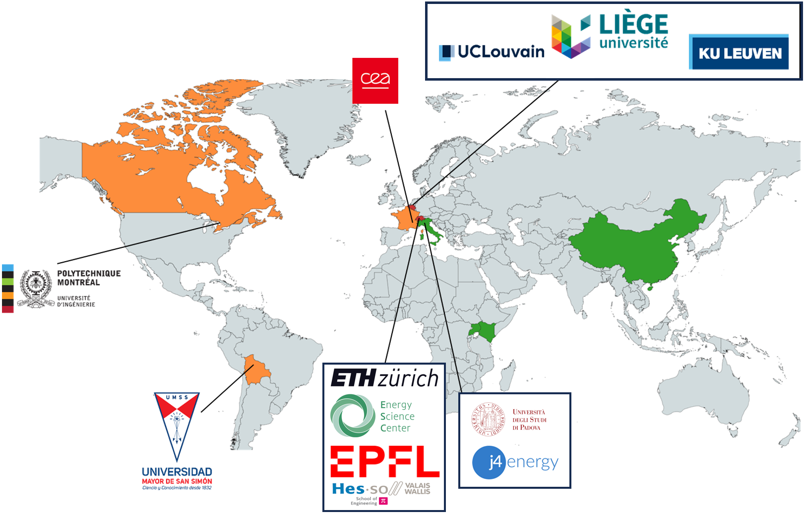

# Community
!!! abstract "News"  
    - The **EnergyScope Symposium** this year will take place from **October 16-17** in **Sion, Switzerland**. 
    - Further information for the registration process will follow soon.

## Join the Discussion

Use the EnergyScope Forum, to find FAQs, ask your own questions, share ideas, and discuss features with the community:

  <a href='https://forum.energyscope.net/' target="_blank" 
     style="padding: 10px 20px; background-color:rgb(58, 113, 223); color: white; 
            text-decoration: none; border-radius: 4px; display: inline-block;">
    Join the EnergyScope Forum.
  </a>

---

## Who is using EnergyScope?

---

## Partners and Team

Energyscope is developed by a dedicated team at EPFL, ETHZ, UCLouvain and PolyMTL, with contributions from the global community:

-   [Stefano Moret](mailto:morets@ethz.ch) (EnergyScope Creator)  
-   [Gauthier Limpens](mailto:gauthier.limpens@uclouvain.be) (EnergyScope Improver)  
-   [Jonas Schnidrig](mailto:jonas.schnidrig@hevs.ch) (Library, Plotting, Documentation, Development)  
-   [Xavier Rixhon](mailto:xavier.rixhon@uclouvain.be) (EnergyScope Developer, Documentation)  
-   [Arthur Chuat](mailto:arthur.chuat@epfl.ch) (Library, Plotting, Documentation, Development)  
-   [Gabriel Wiest](mailto:gwiest@ethz.ch) (Library, Plotting, Documentation, Development)
-   [Matthieu Souttre](mailto:matthieu.souttre@epfl.ch) (Library, Documentation, Development)
-   [Nicolas Ghuys](mailto:nicolas.ghuys@ucl.be) (Core Model Development)
-   [Cyrille Platteau](mailto:cyrille.platteau@epfl.ch) (IT)

If you are interested in a specific topic, have a look at the [Publications](../models/index.md#publications-table) and [Features](../features/index.md) or contact one of the team members related to the development of the feature.

---