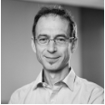
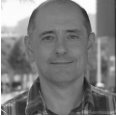
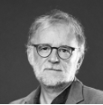
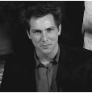
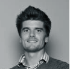
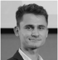
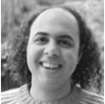

# Community
!!! abstract "News"  
    - The **EnergyScope Symposium** this year will take place from **October 16-17** in **Sion, Switzerland**. 
    - If you plan to join, please **[register here](https://docs.google.com/forms/d/e/1FAIpQLSeX9KpgItTzHaW1_Ou8IxO0bGC48mQK-W2T7tMFodIFljGAsQ/viewform?usp=dialog)**.

## Join the Discussion

Use the EnergyScope Forum, to find FAQs, ask your own questions, share ideas, and discuss features with the community:

  <a href='https://forum.energyscope.net/' target="_blank" 
     style="padding: 10px 20px; background-color:rgb(58, 113, 223); color: white; 
            text-decoration: none; border-radius: 4px; display: inline-block;">
    Join the EnergyScope Forum.
  </a>

---

## Who is using EnergyScope?

---
## Partners and Team

Energyscope is developed by a dedicated international committee structure:

### Steering Committee

<table style="border:none;">
  <tr>
    <td style="border:none;">
       
      <a href="https://ciraig.org/index.php/team/sara-russo-garrido/">
        <b>Sara Russo Garrido</b> 
        CIRAIG (UQAM) 
        <i>SC President</i>
      </a>
    </td>
    <td style="border:none;">
       
      <a href="https://ciraig.org/index.php/team/manuele-margni/">
        <b>Manuele Margni</b> 
        CIRAIG (HES-So)
      </a>
    </td>
    <td style="border:none;">
       
      <a href="https://www.cea.fr/energies/i-tese/Pages/Qui-sommes-nous/Notre-equipe/BOISSONNET-Guillaume.aspx">
        <b>Guillaume Boissonnet</b> 
        CEA
      </a>
    </td>
    <td style="border:none;">
       
      <a href="https://people.epfl.ch/francois.marechal">
        <b>François Maréchal</b> 
        EPFL
      </a>
    </td>
  </tr>
  <tr>
    <td style="border:none;">
       
      <a href="https://esc.ethz.ch/people/person-detail.guidati.html">
        <b>Gianfranco Guidati</b> 
        ETHZ
      </a>
    </td>
    <td style="border:none;">
       
      <a href="https://www.squoilin.eu/">
        <b>Sylvain Quoilin</b> 
        U Liège
      </a>
    </td>
    <td style="border:none;">
       
      <a href="https://www.stefanomoret.com/">
        <b>Stefano Moret</b> 
        ETHZ
      </a>
    </td>
    <td style="border:none;">
       
      <a href="">
        <b>Xavier Rixhon</b> 
        UC Louvain
      </a>
    </td>
  </tr>
  <tr>
    <td style="border:none;">
       
      <a href="https://people.epfl.ch/jonas.schnidrig">
        <b>Jonas Schnidrig</b> 
        CIRAIG (HES-So & EPFL)
      </a>
    </td>
    <td style="border:none;"></td>
    <td style="border:none;"></td>
    <td style="border:none;"></td>
  </tr>
</table>

### Technical Committee

<table border="0" style="border:none;">
  <tr>
    <td style="border:none;">
       
      <a href="https://www.stefanomoret.com/">
        <b>Stefano Moret</b> 
        ETHZ
      </a>
    </td>
    <td style="border:none;">
       
      <a href="">
        <b>Xavier Rixhon</b> 
        UC Louvain
      </a>
    </td>
    <td style="border:none;">
       
      <a href="https://people.epfl.ch/jonas.schnidrigh">
        <b>Jonas Schnidrig</b> 
        CIRAIG (HES-So & EPFL) 
        <i>TC Coordinator</i>
      </a>
    </td>
    <td style="border:none;">
       
      <a href="https://people.epfl.ch/arthur.chuat/?lang=en">
        <b>Arthur Chuat</b> 
        CIRAIG (EPFL)
      </a>
    </td>
  </tr>
  <tr>
    <td style="border:none;">
       
      <a href="https://epse.ethz.ch/the-group/people/wiest-gabriel.html">
        <b>Gabriel Wiest</b> 
        ETHZ
      </a>
    </td>
    <td style="border:none;">
       
      <a href="https://mavt.ethz.ch/people/person-detail.MzQ5MDI2.TGlzdC81NTksLTE3MDY5NzgwMTc=.html">
        <b>Evren Turan Mert</b> 
        ETHZ
      </a>
    </td>
    <td style="border:none;">
       
      <a href="mailto:infot@energyscope.net">
        <b>You?</b> 
        <i>Get in touch!</i>
      </a>
    </td>
    <td style="border:none;"></td>
  </tr>
</table>

If you are interested in a specific topic, have a look at the [Publications](../models/index.md#publications-table) and [Features](../features/index.md) or contact one of the team members related to the development of the feature.

---