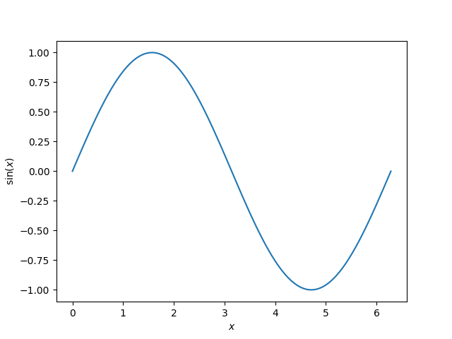

<!--
 DO NOT EDIT.
 THIS FILE WAS AUTOMATICALLY GENERATED BY mkdocs-gallery.
 TO MAKE CHANGES, EDIT THE SOURCE PYTHON FILE:
 "docs/es_gallery/scripts/00_hourly/plot_general_example.py"
 LINE NUMBERS ARE GIVEN BELOW.
-->

!!! note

    Click [here](#download_links)
    to download the full example code


Thumbnail name
===================================

This text shows when hovering over the thumbnail.

<!-- GENERATED FROM PYTHON SOURCE LINES 8-23 -->


{: .mkd-glr-single-img srcset="../images/mkd_glr_plot_general_example_001.png"}

Out:
{: .mkd-glr-script-out }

```{.shell .mkd-glr-script-out-disp }
C:/Users/gwiest/home/Research/Projects/EnergyScope/energyscope/docs/es_gallery/scripts/00_hourly/plot_general_example.py:19: UserWarning:

FigureCanvasAgg is non-interactive, and thus cannot be shown

This example shows a sin plot!

```


<br />

```{.python }

import numpy as np
import matplotlib.pyplot as plt

x = np.linspace(0, 2 * np.pi, 100)
y = np.sin(x)

plt.plot(x, y)
plt.xlabel(r'$x$')
plt.ylabel(r'$\sin(x)$')
# To avoid matplotlib text output
plt.show()


print('This example shows a sin plot!')
```


**Total running time of the script:** ( 0 minutes  0.109 seconds)

<div id="download_links"></div>


[:fontawesome-solid-download: Download Python source code: plot_general_example.py](./plot_general_example.py){ .md-button .center}

[:fontawesome-solid-download: Download Jupyter notebook: plot_general_example.ipynb](./plot_general_example.ipynb){ .md-button .center}


[Gallery generated by mkdocs-gallery](https://smarie.github.io/mkdocs-gallery){: .mkd-glr-signature }
