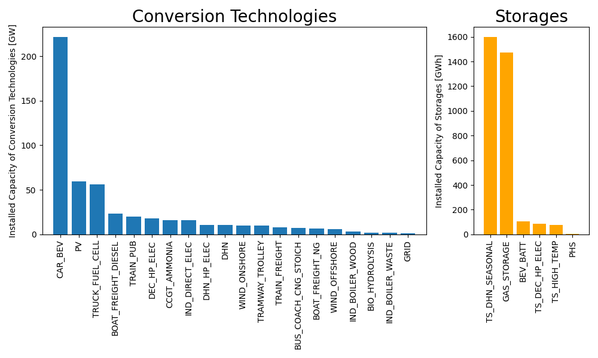

<!--
 DO NOT EDIT.
 THIS FILE WAS AUTOMATICALLY GENERATED BY mkdocs-gallery.
 TO MAKE CHANGES, EDIT THE SOURCE PYTHON FILE:
 "docs/es_gallery/scripts/00_hourly/plot_installed_capacity.py"
 LINE NUMBERS ARE GIVEN BELOW.
-->

!!! note

    Click [here](#download_links)
    to download the full example code


Installed  Capacity
===================================

This is an example using the core model.

<!-- GENERATED FROM PYTHON SOURCE LINES 9-13 -->

```{.python }

import matplotlib.pyplot as plt
from energyscope.energyscope import Energyscope
from energyscope.models import core
```


<!-- GENERATED FROM PYTHON SOURCE LINES 14-17 -->

```{.python }
thresh = 1
figsize = (10, 6)

```


<!-- GENERATED FROM PYTHON SOURCE LINES 18-19 -->

Create a model and calculate the results

<!-- GENERATED FROM PYTHON SOURCE LINES 19-22 -->

```{.python }
es_core = Energyscope(model=core)
results = es_core.calc()

```


Out:
{: .mkd-glr-script-out }

```{.shell .mkd-glr-script-out-disp }
Gurobi 12.0.1: Gurobi 12.0.1: optimal solution; objective 47572.10868
43903 simplex iterations
60 barrier iterations

```


<!-- GENERATED FROM PYTHON SOURCE LINES 23-61 -->

```{.python }
F = results.variables["F"]
storages = results.sets['STORAGE_TECH']["STORAGE_TECH"].values

F_storage = F[F.index.get_level_values(0).isin(storages)]
F_tech = F[~F.index.get_level_values(0).isin(storages)]

# Sort by size
F_storage = F_storage.sort_values(by=F_storage.columns[0], ascending=False)
F_storage = F_storage[F_storage.values[:,0]>thresh]
F_tech = F_tech[F_tech.values[:,0]>thresh]
F_tech = F_tech.sort_values(by=F_tech.columns[0], ascending=False)


# Calculate subplot widths proportional to number of bars
n_tech = len(F_tech)
n_storage = len(F_storage)
total = n_tech + n_storage
widths = [n_tech, n_storage] if total > 0 else [1, 1]

fig, axes = plt.subplots(1, 2, figsize=figsize, gridspec_kw={'width_ratios': widths})

# Technologies subplot (left)
axes[0].bar(x=range(n_tech), height=F_tech.values[:, 0])
axes[0].set_xticks(range(n_tech))
axes[0].set_xticklabels(F_tech.index, rotation=90)
axes[0].set_ylabel('Installed Capacity of Conversion Technologies [GW]')
axes[0].set_xlim(-1, n_tech)
axes[0].set_title('Conversion Technologies', fontsize=20)

# Storages subplot (right)
axes[1].bar(x=range(n_storage), height=F_storage.values[:, 0], color='orange')
axes[1].set_xticks(range(n_storage))
axes[1].set_xticklabels(F_storage.index, rotation=90)
axes[1].set_ylabel('Installed Capacity of Storages [GWh]')
axes[1].set_xlim(-1, n_storage)
axes[1].set_title('Storages', fontsize=20)

plt.tight_layout()
plt.show()```


{: .mkd-glr-single-img srcset="../images/mkd_glr_plot_installed_capacity_001.png"}

Out:
{: .mkd-glr-script-out }

```{.shell .mkd-glr-script-out-disp }
C:/Users/gwiest/home/Research/Projects/EnergyScope/energyscope/docs/es_gallery/scripts/00_hourly/plot_installed_capacity.py:61: UserWarning:

FigureCanvasAgg is non-interactive, and thus cannot be shown


```


**Total running time of the script:** ( 0 minutes  32.578 seconds)

<div id="download_links"></div>


[:fontawesome-solid-download: Download Python source code: plot_installed_capacity.py](./plot_installed_capacity.py){ .md-button .center}

[:fontawesome-solid-download: Download Jupyter notebook: plot_installed_capacity.ipynb](./plot_installed_capacity.ipynb){ .md-button .center}


[Gallery generated by mkdocs-gallery](https://smarie.github.io/mkdocs-gallery){: .mkd-glr-signature }
