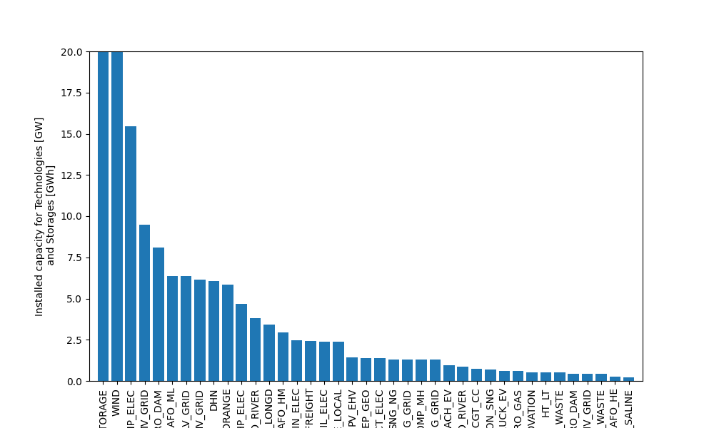

<!--
 DO NOT EDIT.
 THIS FILE WAS AUTOMATICALLY GENERATED BY mkdocs-gallery.
 TO MAKE CHANGES, EDIT THE SOURCE PYTHON FILE:
 "docs/es_gallery/scripts/00_typical_day/plot_installed_capacity.py"
 LINE NUMBERS ARE GIVEN BELOW.
-->

!!! note

    Click [here](#download_links)
    to download the full example code


Installed  Capacity
===================================

This is a general example.

<!-- GENERATED FROM PYTHON SOURCE LINES 9-15 -->

```{.python }

import matplotlib.pyplot as plt
from energyscope.energyscope import Energyscope
from energyscope.models import infrastructure_ch_2050, Model
from energyscope.result import postprocessing

```


<!-- GENERATED FROM PYTHON SOURCE LINES 16-19 -->

```{.python }
thresh = 1e-1
figsize = (10, 6)

```


<!-- GENERATED FROM PYTHON SOURCE LINES 20-21 -->

Create a model and calculate the results

<!-- GENERATED FROM PYTHON SOURCE LINES 21-25 -->

```{.python }
es_infra_ch = Energyscope(model=infrastructure_ch_2050)
results_ch = es_infra_ch.calc()
results_ch = postprocessing(results_ch)

```


Out:
{: .mkd-glr-script-out }

```{.shell .mkd-glr-script-out-disp }
Gurobi 12.0.1: Gurobi 12.0.1: optimal solution; objective 9229.741872
7320 simplex iterations
1 branching node

```


<!-- GENERATED FROM PYTHON SOURCE LINES 26-38 -->

```{.python }
plt.figure(figsize=figsize)
F_Mult = results_ch.variables["F_Mult"]
F_mult = F_Mult[F_Mult.values[:,0]>thresh] # filter out values smaller than threshold
F_mult = F_mult.sort_values(by=F_Mult.columns[0], ascending=False) # sort by installed capacity

plt.bar(x=range(len(F_mult)),height=F_mult.values[:,0])
#plt.yscale('log')
plt.xticks(range(len(F_mult)), F_mult.index, rotation=90)

plt.ylabel('Installed capacity for Technologies [GW]\n and Storages [GWh]')
plt.xlim(-1, len(F_mult))
plt.ylim(0,20)
plt.show()```


{: .mkd-glr-single-img srcset="../images/mkd_glr_plot_installed_capacity_001.png"}

Out:
{: .mkd-glr-script-out }

```{.shell .mkd-glr-script-out-disp }
C:/Users/gwiest/home/Research/Projects/EnergyScope/energyscope/docs/es_gallery/scripts/00_typical_day/plot_installed_capacity.py:38: UserWarning:

FigureCanvasAgg is non-interactive, and thus cannot be shown


```


**Total running time of the script:** ( 0 minutes  2.714 seconds)

<div id="download_links"></div>


[:fontawesome-solid-download: Download Python source code: plot_installed_capacity.py](./plot_installed_capacity.py){ .md-button .center}

[:fontawesome-solid-download: Download Jupyter notebook: plot_installed_capacity.ipynb](./plot_installed_capacity.ipynb){ .md-button .center}


[Gallery generated by mkdocs-gallery](https://smarie.github.io/mkdocs-gallery){: .mkd-glr-signature }
