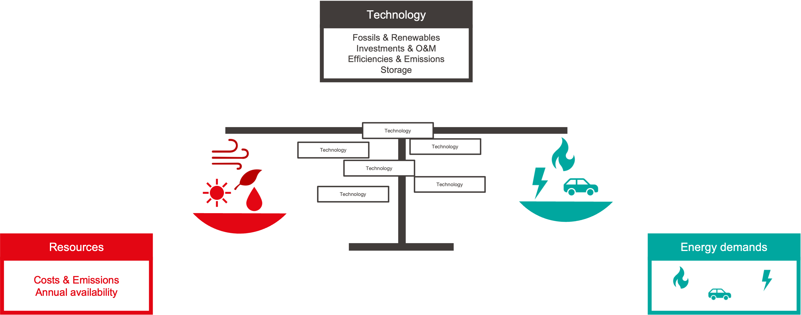
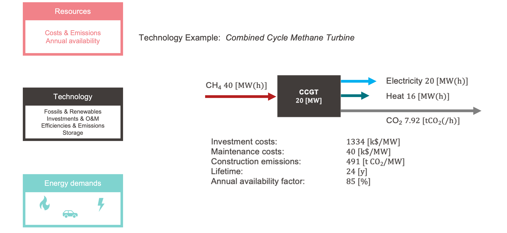
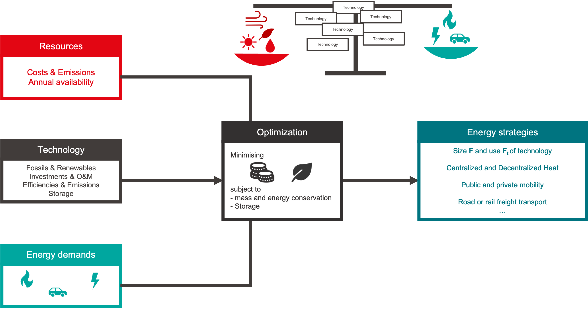

# Conceptual Foundations

The **EnergyScope** library is grounded in several key principles and concepts that guide how energy systems are modeled. This section explains the underlying philosophy of **EnergyScope**, defines the core terminologies, and discusses how the library handles resolution challenges to ensure both computational efficiency and accuracy.

---

## Philosophy of EnergyScope Modeling

!!! abstract "Philosophy of EnergyScope Modeling Summary"
    **EnergyScope** balances simplicity, transparency, computational efficiency, and accuracy, making it a versatile and powerful tool for modeling energy systems. It remains accessible to both expert and non-expert users while maintaining the precision needed for real-world energy system optimization.

**EnergyScope** is built on a foundation that prioritizes simplicity, transparency, computational efficiency, and accuracy. These principles ensure that users can apply the model to a wide range of energy systems without compromising on the quality of the analysis.

- **Simplicity**: The model is designed to be user-friendly, enabling non-experts to apply it to their energy system modeling tasks. Simplicity does not mean sacrificing detail; rather, **EnergyScope** provides intuitive access to complex energy system behaviors.
  
- **Transparency**: The open-source nature of **EnergyScope** ensures that users can inspect the model’s assumptions, parameters, and calculations. This transparency makes the model accessible and trustworthy for academic research, policy analysis, and industry applications.

- **Computational Efficiency**: **EnergyScope** optimizes its internal processes to minimize computational time without sacrificing detail or accuracy. This is achieved through techniques such as the use of **Typical Days** to represent annual energy dynamics (discussed further in the resolution section).

- **Accuracy**: Despite its focus on efficiency, **EnergyScope** remains highly accurate in its representation of energy systems. The model integrates sectoral interactions, storage solutions, and renewable energy intermittency to provide detailed insights into system performance and optimization.

---

## Key Concepts and Terminologies

!!! abstract "Key Concepts and Terminologies Summary"
    **EnergyScope** relies on core concepts such as *energy carriers*, *demand sectors*, and *conversion technologies* to model energy flows and optimize system performance. Energy balance and optimization ensure that supply meets demand efficiently across all sectors.

To effectively use **EnergyScope**, it's essential to understand the core concepts and terminologies that underpin the model. These concepts define how energy flows, conversions, and optimizations are represented and executed within the system.

### Fundamental Terms and Definitions

- **Energy Carriers**: These are the forms of energy that move through the system, including electricity, heat, and fuels. Carriers are generated, converted, and consumed across various sectors in the energy system.
  
- **Demand Sectors**: **EnergyScope** models energy demand across different sectors such as residential, industrial, transportation, and commercial. Each sector has distinct energy demand profiles, and these must be met by energy carriers.

- **Conversion Technologies**: Technologies that convert one form of energy into another, such as power plants (converting fuel into electricity) or heat pumps (converting electricity into heat). Conversion efficiency and costs are key attributes of these technologies in **EnergyScope**.

  
  > This figure shows the balance principle in energy systems: energy flows between resources (and imports), technologies, and energy service demands. It highlights how **EnergyScope** tracks energy inputs and outputs to ensure system optimization.

### Energy Balance and Optimization Principles

- **Energy Balance**: The core principle of **EnergyScope** is that energy supplied by carriers must always meet energy demand. The model ensures that all energy produced or imported into the system is either consumed, stored, or exported, accounting for all energy flows within the system.

- **Optimization**: **EnergyScope** applies optimization techniques to find the most cost-effective or efficient solutions for meeting energy demands. By minimizing costs or emissions, the model identifies optimal strategies for deploying energy resources and technologies.

  
  > This diagram illustrates how **EnergyScope** maintains energy balance across different technologies, sectors, and energy carriers. The optimization process ensures that energy flows are allocated in the most efficient way possible.

---

## Resolution Challenges in Energy Modeling

One of the most significant challenges in energy system modeling is managing temporal resolution. High-resolution models, which simulate energy flows on an hourly basis, can become computationally expensive, especially when dealing with large systems. **EnergyScope** addresses these challenges through the use of **Typical Days** (TDs), a method that significantly reduces computational demands without sacrificing accuracy.

### Temporal Resolution Issues 

!!! abstract "Resolution Challenges in Energy Modeling Summary"
    **EnergyScope** uses **Typical Days** to reduce computational complexity while maintaining accuracy in energy system simulations. This method strikes a balance between detailed temporal resolution and computational efficiency, ensuring that large-scale systems can be modeled efficiently.

#### Typical Days Approach

- **Temporal Resolution Challenges**: Simulating an entire year with hourly resolution (8760 hours) presents a significant computational burden. Each hour requires separate calculations for energy demand, supply, and conversions, making the model impractical for large-scale systems or detailed scenario analysis.

- **Typical Days (TDs)**: To overcome this, **EnergyScope** employs **Typical Days**—a small subset of days that represent the key temporal dynamics of the system across the year. By selecting a representative set of days, the model captures the seasonal and daily variations in energy demand and supply without needing to simulate every hour of the year.

- **Temporal Optimization**: Once **Typical Days** are selected, the model runs optimizations over these days to simulate the energy system’s behavior. By focusing on representative periods, **EnergyScope** reduces simulation time while preserving the key characteristics of the energy system’s operation.

### Balancing Computational Efficiency with Model Accuracy

While **Typical Days** streamline the modeling process, there are inherent trade-offs involved in this approach. Using a subset of days may introduce challenges in accurately modeling long-term storage requirements or rare peak demand events that fall outside of the selected days. However, **EnergyScope** mitigates these challenges by carefully selecting **Typical Days** that reflect the most significant temporal variations in energy supply and demand.

  
  > This figure illustrates the principle of temporal resolution in **EnergyScope**, showing how the model balances high-resolution temporal dynamics with the need for computational efficiency.

