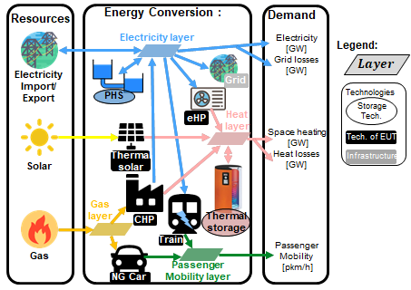
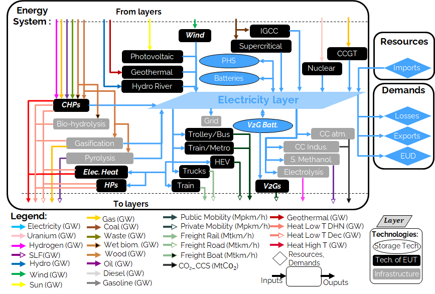
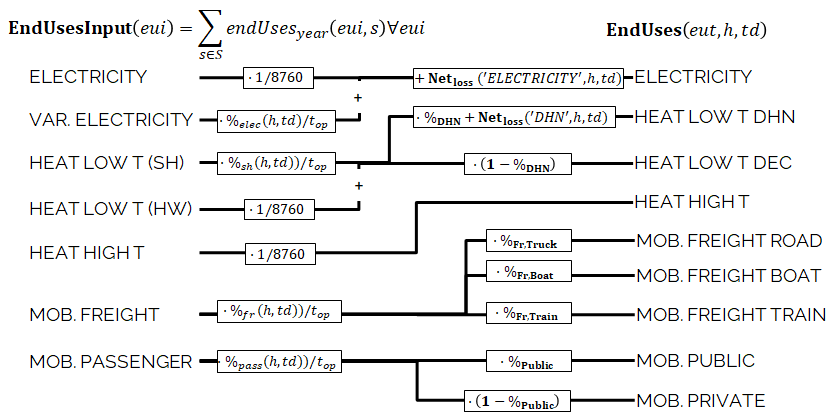

This section documents the models and data files that are part of the "core" version of EnergyScope, which can be set-up by following the [Getting Started](../getting-started/index.md) page. Alternatively you can download the model and data files using this button:

  <a href='https://gitlab.com/energyscope/energyscope/-/raw/main/docs/assets/ES-core.zip?ref_type=heads&inline=false' target="_blank" 
     style="padding: 10px 20px; background-color:rgb(58, 113, 223); color: white; 
            text-decoration: none; border-radius: 4px; display: inline-block;">
    Download AMPL files for core version.
  </a>

The core version includes three files, which we document in the following:

- A model file (ESTD_model_core.mod) containing the equations
- A data file (ESTD_model_core.dat) containing non-time-dependent data
- A Typical Day (ESTD_12TD.dat) data file (.dat) containing time-dependent data

## Preliminaries

The model is mathematically formulated as a linear programming (LP) problem. The following figure represents, in a simple manner, what an LP problem is and the associated nomenclature.

The proposed modeling framework is a simplified representation of an energy system accounting for the energy flows within its boundaries. Its primary objective is to satisfy the energy balance constraints, meaning that the demand is known and the supply has to meet it. In energy modeling practice, the energy demand is often expressed in terms of final energy consumed (FEC). According to the definition of the European Commission, FEC is defined as "the energy which reaches the final consumer’s door" ([EU_FEC](https://www.eea.europa.eu/en/analysis/indicators/primary-and-final-energy-consumption)). In other words, the FEC is the amount of input energy needed to satisfy the end-use demand (EUD) in energy services. As an example, in the case of decentralized heat production with an NG boiler, the FEC is the amount of NG consumed by the boiler; the EUD is the amount of heat produced by the boiler, i.e., the heating service needed by the final user.

The input for the proposed modeling framework is the EUD in energy services, represented as the sum of three energy sectors: electricity, heating, and mobility. This replaces the classical economic-sector-based representation of energy demand. Heat is divided into three EUDs: high-temperature heat for industry, low temperature for space heating, and low temperature for hot water. Mobility is divided into two EUDs: passenger and freight mobility.

A simplified conceptual example of the energy system structure is proposed in the following figure. The system is split into three parts: resources, energy conversion, and demand. In this illustrative example, resources are solar energy, electricity, and NG. The EUD are electricity, space heating, and passenger mobility. The energy system encompasses all the energy conversion technologies needed to transform resources and supply the EUD. In this example, Solar and NG resources cannot be directly used to supply heat. Thus, they use technologies, such as boilers or CHP for NG, to supply the end-use type (EUT) layer (e.g., the high-temperature industrial heat layer). Layers are defined as all the elements in the system that need to be balanced in each time period; they include resources and EUTs. As an example, the electricity layer must be balanced at any time, meaning that the production and storage must equal the consumption and losses. These layers are connected to each other by technologies. We define three types of technologies: technologies of end-use type, storage technologies, and infrastructure technologies. A technology of end-use type can convert the energy (e.g., a fuel resource) from one layer to an EUT layer, such as a CHP unit that converts NG into heat and electricity. A storage technology converts energy from a layer to the same one, such as thermal storage (TS) that stores heat to provide heat. In this example, there are two storage technologies: TS for heat and pumped-hydro storage (PHS) for electricity. An infrastructure technology gathers the remaining technologies, including the networks, such as the power grid and district heating networks (DHNs), but also technologies linking non end-use layers, such as methane production from wood gasification or hydrogen production from methane reforming.

As an illustrative example of the concept of *layer*, the following figure gives a perspective of the electricity layer which is the most complex one, since the electrification of other sectors is foreseen as a key of the energy transition ([Sugiyama2012](https://doi.org/10.1016/j.enpol.2012.01.028)). In the proposed version, 42 technologies are related to the electricity layer. Nine technologies produce exclusively electricity, such as CCGT, PV, or wind. Twelve cogenerations of heat and power (CHPs) produce heat and electricity, such as industrial waste CHP. Six technologies are related to the production of synthetic fuels and CCS. One infrastructure represents the grid. Four storage technologies are implemented, such as PHS, batteries, or V2G. The remains are consumers regrouped in the electrification of heat and mobility. Electrification of the heating sector is supported by direct electric heating but also by the more expensive but more efficient electrical heat pumps for low temperature heat demand. Electrification of mobility is achieved via electric public transportation (train, trolley, metro, and electrical/hybrid buses), electric private transportation, and trains for freight.

The energy system is formulated as an LP problem. It optimizes the design by computing the installed capacity of each technology, as well as the operation in each time period, to meet the energy demand and minimize the total annual cost of the system. In the following, we present the complete formulation of the model in two parts. First, all the terms used are summarized in a figure and tables: the figure for sets, tables for parameters, and tables for independent and dependent variables. On this basis, the equations representing the constraints and the objective function are formulated in the figure and equations and described in the following paragraphs.

## Model Formulation (mod file)
An ampl model begins by declaring the sets and parameters that will be used in the rest of the model file. Default values and bounds on the parameters are set in the .mod file, and will be overwritten when the corresponding input file is read. 
### Sets, Parameters, and Variables

The figure gives a visual representation of the sets with their relative indices used in the following. The tables list and describe the model parameters. Tables list and describe the independent and dependent variables, respectively.

##### Time Series Parameters

| **Parameter**             | **Units** | **Description**           |
|---------------------------|-----------|---------------------------|
| $\%_{elec}(h,td)$         | [-]       | Yearly time series (adding up to 1) of electricity end-uses      |
| $\%_{sh}(h,td)$           | [-]       | Yearly time series (adding up to 1) of SH end-uses               |
| $\%_{mob}(h,td)$          | [-]       | Yearly time series (adding up to 1) of passenger mobility end-uses|
| $\%_{fr}(h,td)$           | [-]       | Yearly time series (adding up to 1) of freight mobility end-uses |
| $c_{p,t}(tech,h,td)$      | [-]       | Hourly maximum capacity factor for each technology (default 1)   |

These parameters are finalized when the typical day data file (ESTD_12TD.dat) is read in.

##### List of Parameters (except time series)

| **Parameter**             | **Units**                     | **Description**            |
|---------------------------|-------------------------------|----------------------------|
| $endUses_{year}$          | [GWh/y] [^a]_                  | End-uses demand vs sectors (input to the model). Yearly values. |
| $endUsesInput(eui)$       | [GWh/y] [^a]_                  | Total demand for each type of end-uses across sectors (yearly energy) as input from the demand-side model. |
| $i_{rate}$                | [-]                           | Real discount rate |
| $gwp_{limit}$             | [ktCO$_{2-eq}$/y]             | Maximum gwp emissions allowed. |
| $\%_{public,min}, \%_{public,max}$ | [-]           | Min/max limit for penetration of public mobility over total mobility |
| $\%_{fr,rail,min}, \%_{fr,rail,max}$ | [-]         | Min/max limit for penetration of train in freight transportation |
| $\%_{fr,boat,min}, \%_{fr,boat,max}$ | [-]         | Min/max limit for penetration of boat in freight transportation |
| $\%_{fr,truck,min}, \%_{fr,truck,max}$ | [-]        | Min/max limit for penetration of truck in freight transportation |
| $\%_{dhn,min}, \%_{dhn,max}$ | [-]                  | Min/max limit for penetration of dhn in low-T heating |
| $t_{op}(h,td)$            | [h]                           | Operating time |
| $f_{max}(tech), f_{min}(tech)$  | [GW] [^a]_ [^b]_                | Maximum/minimum feasible installed capacity [GW], refers to main output. storage level [GWh] for STORAGE_TECH |
| $f_{max,\%}(tech), f_{min,\%}(tech)$ | [-]                | Max/min % of sector output per technology |
| $avail(res)$              | [GWh/y]                       | Yearly availability of resources |
| $c_{op}(res)$             | [M€$_{2015}$/GWh]             | Cost of resources in the different periods |
| $veh_{capa}$              | [km-pass/h/veh.] [^a]_         | Average capacity (pass-km/h or t-km/h) per vehicle. It makes the link between F and the number of vehicles |
| $f(res \cup tech \setminus sto, l)$ | [GW] [^c]_     | Input/output Resources/Technologies to Layers. Reference is one unit ([GW] or [Mpkm/h] or [Mtkm/h]) of (main) output of the resource/technology. input to layer (output of technology) > 0. |
| $c_{inv}(tech)$           | [M€$_{2015}$/GW] [^c]_ [^b]_    | Specific investment cost [Meuros/GW].[Meuros/GWh] for STORAGE_TECH |
| $c_{maint}(tech)$         | [M€$_{2015}$/GW/y] [^c]_ [^b]_  | O&M cost [Meuros/GW/year]: O&M cost does not include resource (fuel) cost. [Meuros/GWh/year] for STORAGE_TECH |
| $\tau(\text{tech})$       | [-]       | Annualization factor for each technology, used to convert investment costs into equivalent annual costs. Calculated as:   $\tau(j) = \frac{i_{\text{rate}} (1 + i_{\text{rate}})^{\text{lifetime}(j)}}{(1 + i_{\text{rate}})^{\text{lifetime}(j)} - 1} \qquad \forall j \in \text{TECH}$ |
| $gwp_{constr}(tech)$      | [ktCO$_2$-eq./GW] [^a]_ [^b]_   | GWP emissions associated to the construction of technologies [ktCO2-eq./GW]. Refers to [GW] of main output |
| $gwp_{op}(res)$           | [ktCO$_2$-eq./GWh]            | GWP emissions associated to the use of resources [ktCO2-eq./GWh]. Includes extraction/production/transportation and combustion |
| $c_{p}(tech)$             | [-]                           | Yearly capacity factor of each technology [-], defined on annual basis. Different than 1 if sum {t in PERIODS} F_t (t) <= c_p * F |
| $\eta_{sto,in}(sto,l),\eta_{sto,out}(sto,l)$ | [-]         | Efficiency of input to storage from layers/efficiency of output from storage to layers. If 0 storage_tech/layer are incompatible |
| $\%_{sto_{loss}}(sto)$    | [1/h]                         | Self losses in storage (required for Li-ion batteries). Value = self discharge in 1 hour. |
| $t_{sto_{in}}(sto)$       | [h]                           | Time to charge storage (Energy to Power ratio). If value =  5 <=>  5h for a full charge. |
| $t_{sto_{out}}(sto)$      | [h]                           | Time to discharge storage (Energy to Power ratio). If value =  5 <=>  5h for a full discharge. |
| $\%_{sto_{avail}}(sto)$   | [-]                           | Storage technology availability to charge/discharge. Used for EVs |
| $\%_{net_{loss}}(eut)$    | [-]                           | Losses coefficient [0; 1] in the networks (grid and DHN) |
| $ev_{batt,size}(v2g)$     | [GWh]                         | Battery size per EVs car technology |
| $c_{grid,extra}$          | [M€$_{2015}$/GW]                | Cost to reinforce the grid due to IRE penetration [Meuros/GW of (PV + Wind)]. |
| $solar_{area}$            | [km$^2$]                      | Maximum land available for PV deployment [km2] |
| $density_{pv}$            | [GW/km$^2$]                   | Maximum power irradiance for PV. |
| $density_{solar,thermal}$ | [GW/km$^2$]                   | Maximum power irradiance for solar thermal. |

These parameters are finalized when the core data file (ESTD_model_core.dat) is read in.

### Variables

Independent variables. All variables are continuous and non-negative, unless otherwise indicated.

| **Variable**             | **Units**                     | **Description**            |
|----------|-------|-------------|
| $\%\_\text{Public}$ | [-] | Ratio $[0;1]$ public mobility over total passenger mobility |
| $\%\_\text{Fr,Rail}$ | [-] | Ratio $[0;1]$ rail transport over total freight transport |
| $\%\_\text{Fr,Boat}$ | [-] | Ratio $[0;1]$ boat transport over total freight transport |
| $\%\_\text{Fr,road}$ | [-] | Ratio $[0;1]$ road transport over total freight transport |
| $\%\_\text{Dhn}$ | [-] | Ratio $[0;1]$ centralized over total low-temperature heat |
| $F(\text{tech})$ | [GW] | Installed capacity with respect to main output |
| $F_t(\text{tech} \cup \text{res}, h, td)$ | [GW]| Operation in each period |
| $\text{Sto}_\text{in}, \text{Sto}_\text{out} (\text{sto}, l, h, td)$ | [GW] | Input to/output from storage units |
| $\%\_\text{PassMob}(\text{TECH OF EUC(PassMob)})$ | [-] | Constant share of passenger mobility |
| $\%\_\text{FreightMob}(\text{TECH OF EUC(FreightMob)})$ | [-] | Constant share of freight mobility |
| $\%\_\text{HeatLowTDEC}(\text{TECH OF EUT(HeatLowTDec)} \setminus \{\text{Dec}_{\text{Solar}}\})$ | [-] | Constant share of low temperature heat decentralised supplied by a technology plus its associated thermal solar and storage |
| $F_\text{sol}(\text{TECH OF EUT(HeatLowTDec)} \setminus \{\text{Dec}_{\text{Solar}}\})$ | [-] | Solar thermal installed capacity associated to a decentralised heating technology |
| $F_{t_\text{sol}}(\text{TECH OF EUT(HeatLowTDec)} \setminus \{\text{Dec}_{\text{Solar}}\})$ | [-] | Solar thermal operation in each period |

Dependent variable. All variables are continuous and non-negative, unless otherwise indicated.

| **Variable**             | **Units**                     | **Description**            |
|----------|-------|-------------|
| $\text{EndUses}(l,h,td)$ | [GW] | End-uses demand. Set to 0 if $l \notin$ EUT |
| $C_\text{tot}$ | [M€$_{2015}$/y] | Total annual cost of the energy system |
| $C_\text{inv}(\text{tech})$ | [M€$_{2015}$] | Technology total investment cost |
| $C_\text{maint}(\text{tech})$ | [M€$_{2015}$/y] | Technology yearly maintenance cost |
| $C_\text{op}(\text{res})$ | [M€$_{2015}$/y] | Total cost of resources |
| $\text{GWP}_\text{tot}$ | [ktCO$_2$-eq./y] | Total yearly GHG emissions of the energy system |
| $\text{GWP}_\text{constr}(\text{tech})$ | [ktCO$_2$-eq.] | Technology construction GHG emissions |
| $\text{GWP}_\text{po}(\text{res})$ | [ktCO$_2$-eq./y] | Total GHG emissions of resources |
| $\text{Net}_\text{losses}(\text{eut},h,td)$ | [GW] | Losses in the networks (grid and DHN) |
| $\text{Sto}_\text{level}(\text{sto},t)$ | [GWh] | Energy stored over the year |

### Constraints

In the following, the equations that make up the core version of EnergyScope are described. The structure corresponds to different sections in the code. It begins with the calculation of the end-use demand, followed by the cost, the global warming potential, and the objective functions. It then continues with more technology- and resource-specific constraints, such as the implementation of *storage*.

### End-use Demand

The hourly end-use demands (**EndUses**) are computed based on the yearly end-use demand (*endUsesInput*), distributed according to its time series (listed in the table). The figure graphically presents the constraints associated with the hourly end-use demand (**EndUses**), e.g., the public mobility demand at time $t$ is equal to the hourly passenger mobility demand times the public mobility share (**%\ Public**).

Electricity end-uses result from the sum of the electricity-only demand, assumed constant throughout the year, and the variable demand for electricity, distributed across the periods according to *%\ elec*. Low-temperature heat demand results from the sum of the yearly demand for HW, evenly shared across the year, and SH, distributed across the periods according to *%\ sh*. The percentage repartition between centralized (DHN) and decentralized heat demand is defined by the variable **%\ Dhn**. High-temperature process heat and freight mobility demand are evenly distributed across the periods. Passenger mobility demand is expressed in passenger-kilometers (pkms), freight transportation demand is in ton-kilometers (tkms). The variable **%\ Public** defines the penetration of public transportation in the passenger mobility sector. Similarly, **%\ Rail**, **%\ Boat**, and **%\ Truck** define the penetration of train, boat, and trucks for freight mobility, respectively.

Imposing the EUD instead of the  final energy consumed (FEC) has two advantages. First, it introduces a clear distinction between demand and supply. On the one hand, the demand concerns the definition of the end-uses, i.e., the requirements in energy services (e.g., the mobility needs). On the other hand, the supply concerns the choice of the energy conversion technologies to supply these services (e.g., the types of vehicles used to satisfy the mobility needs). Based on the technology choice, the same EUD can be satisfied with different FEC, depending on the efficiency of the chosen energy conversion technology. Second, it facilitates the inclusion in the model of electric technologies for heating and transportation.

### Cost, Emissions, and Objective Function

$$\text{min } \textbf{C}_{\textbf{tot}} = \sum_{j \in \text{TECH}} \Big(\textbf{$\tau$}(j) \textbf{C}_{\textbf{inv}}(j) + \textbf{C}_{\textbf{maint}} (j)\Big) + \sum_{i \in \text{RES}} \textbf{C}_{\textbf{op}}(i)\\$$

$$
\textbf{C}_{\textbf{inv}}(j) = c_{\text{inv}}(j) \textbf{F}(j) ~~~~~~ \forall j \in \text{TECH}\\
$$

$$\textbf{C}_{\textbf{maint}}(j) = c_{\text{maint}}(j) \textbf{F}(j) ~~~~~~ \forall j \in \text{TECH}\\$$

$$
\textbf{C}_{\textbf{op}}(i) = \sum_{t \in T | \{h,td\} \in T\_H\_TD(t)} c_{\text{op}}(i) \textbf{F}_{\textbf{t}}(i,h,td) t_{op} (h,td)  
~~~~~~ \forall i \in \text{RES}
$$

The objective is the minimization of the total annual cost of the energy system ($\textbf{C}_{\textbf{tot}}$), defined as the sum of the annualized investment cost of the technologies ($\tau\textbf{C}_{\textbf{inv}}$), the operating and maintenance cost of the technologies ($\textbf{C}_{\textbf{maint}}$), and the operating cost of the resources ($\textbf{C}_{\textbf{op}}$). The total investment cost ($\textbf{C}_{\textbf{inv}}$) of each technology results from the multiplication of its specific investment cost ($c_{inv}$) and its installed size (**F**), the latter defined with respect to the main end-uses output type. ($\textbf{C}_{\textbf{inv}}$) is annualized with the factor $\tau$, calculated based on the interest rate ($i_{\text{rate}}$) and the technology lifetime (*lifetime*). The total cost of the resources is calculated as the sum of the consumption over different periods multiplied by the period duration ($t_{op}$) and the specific cost of the resource ($c_{op}$). Note that summing over the typical days using the set $T\_H\_TD$ is equivalent to summing over the 8760 hours of the year.

$$
\textbf{GWP}_\textbf{tot}  =    \sum_{i \in \text{RES}} \textbf{GWP}_\textbf{op} (i) 
$$

$$
\textbf{GWP}_\textbf{constr}(j) = gwp_{\text{constr}}(j) \textbf{F}(j) ~~~~~~ \forall j \in \text{TECH}
$$

$$
\textbf{GWP}_\textbf{op}(i) = \sum_{t \in T| \{h,td\} \in T\_H\_TD(t)} gwp_\text{op}(i) \textbf{F}_\textbf{t}(i,h,td)  t_{op} (h,td )~~~~~~ \forall i \in \text{RES}
$$

The global annual GHG emissions are calculated using an LCA approach, i.e., taking into account emissions of the technologies and resources ‘from cradle to grave’. For climate change, the natural choice as an indicator is the GWP, expressed in ktCO₂-eq./year. The total yearly emissions of the system ($\textbf{GWP}_{\textbf{tot}}$) are defined as the sum of the emissions related to the construction and end-of-life of the energy conversion technologies ($\textbf{GWP}_{\textbf{constr}}$), allocated to one year based on the technology lifetime ($lifetime$), and the emissions related to resources ($\textbf{GWP}_{\textbf{op}}$). Similarly to the costs, the total emissions related to the construction of technologies are the product of the specific emissions ($gwp_{constr}$) and the installed size ($\textbf{F}$). The total emissions of the consumed resources are the emissions associated with fuels (from cradle to combustion) and imports of electricity ($gwp_{op}$) multiplied by the period duration ($t_{op}$). GWP accounting can be conducted in different manners depending on the scope of emission. The European Commission and the IEA mainly use resource-related emissions ($\textbf{GWP}_{\textbf{op}}$) while neglecting indirect emissions related to the construction of technologies ($\textbf{GWP}_{\textbf{constr}}$). To facilitate the comparison with their results, although $\textbf{GWP}_{\textbf{constr}}$ is calculated, it does not contribute to $\textbf{GWP}_{\textbf{tot}}$.

### Capacity limits

$$
f_{\text{min}} (j) \leq \textbf{F}(j) \leq f_{\text{max}} (j) ~~~~~~ \forall j \in \text{TECH}
$$

The installed capacity of a technology (**F**) is constrained between upper and lower bounds (*f\ max* and *f\ min*). This formulation allows accounting for old technologies still existing in the target year (lower bound) and the maximum deployment potential of a technology. As an example, for offshore wind turbines, $f_{min}$ represents the existing installed capacity (which will still be available in the future), while $f_{max}$ represents the maximum potential.

$$
\textbf{F}_\textbf{t}(i,h,td) \leq \textbf{F}_\textbf{t}(i) \cdot c_{p,t} (i,h,td) ~~~~~~ \forall i \in \text{TECH}, h \in H, td \in TD
$$

$$
\sum_{t \in T| \{h,td\} \in T\_H\_TD(t)} \textbf{F}_\textbf{t}(j,h,td) t_{op}(h,td)  \leq \textbf{F} (j) c_{p} (j) \sum_{t \in T| \{h,td\} \in T\_H\_TD(t)} t_{op} (h,td)  
$$

$$
\forall j \in \text{TECH}
$$

The operation of resources and technologies in each period is determined by the decision variable $\textbf{F}_{\textbf{t}}$. The capacity factor of technologies is conceptually divided into two components: a capacity factor for each period ($c_{p,t}$) depending on resource availability (e.g., renewables), and a yearly capacity factor (*c\ p*) accounting for technology downtime and maintenance. For a given technology, the definition of only one of these two is needed, the other one being fixed to the default value of 1. For example, intermittent renewables are constrained by an hourly load factor ($c_{p,t}\in[0;1]$) while CCGTs are constrained by an annual load factor ($c_{p}$, in that case, 96% in 2035). The equations link the installed size of a technology to its actual use in each period ($\textbf{F}_{\textbf{t}}$) via the two capacity factors.

### Resources

$$
\sum_{t \in T| \{h,td\} \in T\_H\_TD(t)} \textbf{F}_\textbf{t}(i,h,td) t_{op}(h,td)  \leq \text{avail} (i) ~~~~~~ \forall i \in \text{RES}
$$
$$
F_{t}(i, h, td) \cdot t_{op}(h, td) = Import_{constant}(i) \qquad \forall i \in RES\_IMPORT\_CONSTANT,\ h \in HOURS,\ td \in TYPICAL\_DAYS
$$

The total use of resources is limited by the yearly availability ($avail$). Additionally, some resources are constraints to have a constant import flow across the entire year.  

$$
\sum_{i \in \text{RES}~\cup \text{TECH} \setminus \text{STO}} f(i,l) \textbf{F}_\textbf{t}(i,h,td) + \sum_{j \in \text{STO}} \bigg(\textbf{Sto}_\textbf{out}(j,l,h,td) - \textbf{Sto}_\textbf{in}(j,l,h,td)\bigg)  
$$

$$
- \textbf{EndUses}(l,h,td) = 0
$$

$$
\forall l \in L, \forall h \in H, \forall td \in TD
$$

The matrix $f$ defines for all technologies and resources outputs to (positive) and inputs (negative) layers. The equation expresses the balance for each layer: all outputs from resources and technologies (including storage) are used to satisfy the EUD or as inputs to other resources and technologies.

### Storage

$$
\textbf{Sto}_\textbf{level} (j,t) = \textbf{Sto}_\textbf{level} (j,t-1)\cdot\left(1 - \%_{sto_{loss}}(j) \right)  
$$

$$
+ t_{op} (h,td)\cdot \Big(\sum_{l \in L | \eta_{\text{sto,in} (j,l) > 0}} \textbf{Sto}_\textbf{in} (j,l,h,td) \eta_{\text{sto,in}} (j,l) 
$$

$$
- \sum_{l \in L | \eta_{\text{sto,out} (j,l) > 0}} \textbf{Sto}_\textbf{out} (j,l,h,td) / \eta_{\text{sto,out}} (j,l)\Big)
$$

$$
\forall j \in \text{STO}, \forall t \in \text{T}| \{h,td\} \in T\_H\_TD(t)
$$

$$
\textbf{Sto}_\textbf{level} (j,t) = \textbf{F}_\textbf{t} (j,h,td) ~~~~~~ \forall j \in \text{STO DAILY},\forall t \in \text{T}| \{h,td\} \in T\_H\_TD(t)
$$

$$
\textbf{Sto}_\textbf{level} (j,t) \leq \textbf{F} (j) ~~~~~~ \forall j \in \text{STO} \setminus \text{STO DAILY},\forall t \in \text{T}  
$$

The storage level ($\textbf{Sto}_{\textbf{level}}$) at a time step ($t$) is equal to the storage level at $t-1$ (accounting for the losses in $t-1$), plus the inputs to the storage, minus the output from the storage (accounting for input/output efficiencies). In the code, for the first period of the year, this equation is slightly modified to set the storage level at the beginning of the year according to the one at the end of the year. Hence, if $t=1$, we set $t-1$ to the last period of the year (8760). The storage systems which can only be used for short-term (daily) applications are included in the daily storage set (STO DAILY). For these units, the equation imposes that the storage level be the same at the end of each typical day. Adding this constraint drastically reduces the computational time. For the other storage technologies, which can also be used for seasonal storage, the capacity is bounded by the equation. For these units, the storage behavior is thus optimized over 8760 hours. The final constraint requires that the amount stored cannot exceed the size of the storage unit. 

$$
\textbf{Sto}_\textbf{in}(j,l,h,td)\cdot \Big(\lceil  \eta_{sto,in}(j,l)\rceil -1 \Big) = 0  ~~~~~~ \forall j \in \text{STO},\forall l \in \text{L}, \forall h \in \text{H}, \forall td \in \text{TD}
$$

$$
\textbf{Sto}_\textbf{out}(j,l,h,td)\cdot \Big(\lceil  \eta_{sto,out}(j,l)\rceil -1 \Big) = 0  ~~~~~~ \forall j \in \text{STO},\forall l \in \text{L}, \forall h \in \text{H}, \forall td \in \text{TD}
$$

$$
\Big(\textbf{Sto}_\textbf{in} (j,l,h,td)t_{sto_{in}}(\text{j}) + \textbf{Sto}_\textbf{out}(j,l,h,td)t_{sto_{out}}(\text{j})\Big) \leq \textbf{F} (j)\%_{sto_{avail}}(j)
$$

$$
\forall j \in STO \setminus {V2G} , \forall l \in L, \forall h \in H, \forall td \in TD
$$

These equations enforce that storage technologies can only have inputs and outputs to and from certain layers. For example, a PHS will only be linked to the electricity layer (input/output efficiencies $>0$). All other efficiencies will be equal to 0, to prevent the PHS from exchanging with incompatible layers (e.g., mobility, heat, etc.). The equation limits the power input/output of a storage technology based on its installed capacity (**F**) and three specific characteristics. First, storage availability ($\%_{sto_{avail}}$) is defined as the ratio between the available storage capacity and the total installed capacity (default value is 100%). This parameter is only used to realistically represent vehicle-to-grid (V2G), for which we assume that only a fraction of the fleet (i.e., 20% in these cases) can charge/discharge at the same time. Second and third, the charging/discharging time ($t_{sto_{in}}$, $t_{sto_{out}}$), which are the time to complete a full charge/discharge from empty/full storage. As an example, a daily thermal storage needs at least 4 hours to discharge ($t_{sto_{out}}=4 \ [h]$), and another 4 hours to charge ($t_{sto_{in}}=4\ [h]$). The equation applies to all storage except electric vehicles, which are limited by another constraint, presented later.

### Networks

$$
\textbf{Net}_\textbf{loss}(eut,h,td) = \Big(\sum_{i \in \text{RES} \cup \text{TECH} \setminus \text{STO} | f(i,eut) > 0} f(i,eut)\textbf{F}_\textbf{t}(i,h,td) \Big) \%_{\text{net}_{loss}} (eut) 
$$

$$
\forall eut = \text{EUT}, \forall h \in H, \forall td \in TD
$$

$$
\textbf{F} (Grid) = 1 + \frac{c_{grid,extra}}{c_{inv}(Grid)} 
\Big(
\textbf{F}(Wind_{onshore}) + \textbf{F}(Wind_{offshore}) + \textbf{F}(PV)
$$

$$
-\big( 
f_{min}(Wind_{onshore}) + f_{min}(Wind_{offshore}) + f_{min}(PV)
\big)
\Big)
$$

$$
\textbf{F} (DHN) = \sum_{j \in \text{TECH} \setminus {STO} | f(j,\text{HeatLowTDHN}) >0} f(j,\text{HeatLowTDHN}) \cdot \textbf{F} (j) 
$$

The equation calculates network losses as a share ($%_{net_{loss}}$) of the total energy transferred through the network. For example, losses in the electricity grid are estimated to be 4.5% of the energy transferred in 2015. The equations define the extra investment for networks. Integration of intermittent RE implies additional investment costs for the electricity grid ($c_{grid,extra}$). As an example, the reinforcement of the electricity grid is estimated to be 358 million €\ _{2015} per Gigawatt of intermittent renewable capacity installed. The equation links the size of DHN to the total size of the installed centralized energy conversion technologies.

### Mobility constraints

$$
F_{t}(j, h, td) = Shares_{mobility\_passenger}(j) \cdot \left( \frac{endUsesInput_{passenger} \cdot \%_{mob}(h, td)}{t_{op}(h, td)} \right)
\qquad \forall j \in \text{TECH}_{\text{passenger}},\ h \in H,\ td \in TD
$$

$$
F_{t}(j, h, td) = Shares_{mobility\_freight}(j) \cdot \left( \frac{endUsesInput_{freight} \cdot \%_{fr}(h, td)}{t_{op}(h, td)} \right)
\qquad \forall j \in \text{TECH}_{\text{freight}},\ h \in H,\ td \in TD
$$

$$
Share_{freight,train} + Share_{freight,road} + Share_{freight,boat} = 1
$$

The model mobility is modelled by assuming each mobility technology supplies a constant share, and the shares must sum to 1.

### Thermal solar & thermal storage

$$
\textbf{F} (Dec_{Solar}) = \sum_{j \in \text{TECH OF EUT} (\text{HeatLowTDec}) \setminus \{ 'Dec_{Solar}' \}} \textbf{F}_\textbf{sol} (j)  
$$

$$
\textbf{F}_{\textbf{t}_\textbf{sol}} (j,h,td) \leq  \textbf{F}_\textbf{sol} (j)  c_{p,t}('Dec_{Solar}',h,td)
$$

$$
\forall j \in \text{TECH OF EUT} (\text{HeatLowTDec}) \setminus \{ 'Dec_{Solar}' \}, \forall h\in H, \forall td \in TD
$$

Thermal solar is implemented as a decentralized technology. It is always installed together with another decentralized technology, which serves as a backup to compensate for the intermittency of solar thermal. Thus, we define the total installed capacity of solar thermal **F**\ ($Dec_{solar}$) as the sum of **F\ sol**\ ($j$), where $\textbf{F}_{\textbf{sol}}(j)$ is the solar thermal capacity associated with the backup technology $j$. The equation links the installed size of each solar thermal capacity $\textbf{F}_{\textbf{sol}}(j)$ to its actual production $\textbf{F}_{\textbf{t}_\textbf{sol}}(j,h,td))$ via the solar capacity factor ($c_{p,t}('Dec_{solar}')$).

$$
\textbf{F}_\textbf{t} (j,h,td) + \textbf{F}_{\textbf{t}_\textbf{sol}} (j,h,td)  
$$

$$
+ \sum_{l \in \text{L}}\Big( \textbf{Sto}_\textbf{out} (i,l,h,td) - \textbf{Sto}_\textbf{in} (i,l,h,td) \Big)
$$

$$
= \textbf{%}_\textbf{HeatDec}(\text{j}) \textbf{EndUses}(HeatLowT,h,td) 
$$

$$
\forall j \in \text{TECH OF EUT} (\text{HeatLowTDec}) \setminus \{ 'Dec_{Solar}' \}, 
$$

$$
i \in \text{TS OF DEC TECH}(j)  , \forall h\in H, \forall td \in TD
$$

A thermal storage $i$ is defined for each decentralized heating technology $j$, to which it is related via the set *TS OF DEC TECH*, i.e., $i$\ =\ *TS OF DEC TECH(j)*. Each thermal storage $i$ can store heat from its technology $j$ and the associated thermal solar $\textbf{F}_{\textbf{sol}}$ ($j$). Similarly to the passenger mobility, the equation makes the model more realistic by defining the operating strategy for decentralized heating. In fact, in the model, we represent decentralized heat in an aggregated form; however, in a real case, residential heat cannot be aggregated. A house heated by a decentralized gas boiler and solar thermal panels should not be able to be heated by the electrical heat pump and thermal storage of the neighbors, and vice-versa. Hence, the equation imposes that the use of each technology ($\textbf{F}_{\textbf{t}}(j,h,td)$), plus its associated thermal solar ($\textbf{F}_{\textbf{t}_\textbf{sol}}(j,h,td)$) plus its associated storage outputs ($\textbf{Sto}_{\textbf{out}}(i,l,h,td)$) minus its associated storage inputs ($\textbf{Sto}_{\textbf{in}}(i,l,h,td)$) should be a constant share ($\textbf{%}_{\textbf{HeatDec}}(j)$) of the decentralized heat demand ($\textbf{EndUses}(HeatLowT,h,td)$). The figure shows, through an example with two technologies (a gas boiler and an HP), how decentralized thermal storage and thermal solar are implemented.

### Charging and energy storage of EVs

$$
F(i) = \frac{F(j)}{\text{vehicle_capacity}(j)} \cdot \text{batt_per_car}(j)
\qquad \forall j \in \text{V2G},\ i \in \text{EVs_BATT_OF_V2G}(j)
$$

The above equations describe the modeling of electric vehicle (EV) battery storage and its integration with vehicle-to-grid (V2G) technologies. The total battery storage capacity associated with V2G technologies is proportional to the number of vehicles and the battery capacity per vehicle. 

$$
\text{Sto}_\text{out}(i,\, \text{ELECTRICITY},\, h,\, td) \geq 
-\, \text{layers_in_out}(j,\, \text{ELECTRICITY}) \cdot F_t(j,\, h,\, td)
\qquad
\forall\, j \in \text{V2G},\;
i \in \text{EVs_BATT_OF_V2G}(j),\;
h \in \text{HOURS},\;
td \in \text{TYPICAL_DAYS}
$$

The electricity supplied by EVs must be drawn from their own battery storage.

### Miscellaneous 

The following are miscellaneous, but common constraints, introduced for improving the realism of scenarios.

$$
\textbf{GWP}_\textbf{tot} \leq gwp_{limit}  
$$

This requires the global warming potential to be less than a certain value.

$$
f_{\text{min,\%}}(j) \sum_{j' \in \text{TECH OF EUT} (eut),t \in T|\{h,td\} \in T\_H\_TD(t)}    \textbf{F}_\textbf{t}(j',h,td)\cdot t_{op}(h,td)  
$$

$$
\leq 
\sum_{t \in T|\{h,td\} \in T\_H\_TD(t)}  \textbf{F}_\textbf{t} (j,h,td)\cdot t_{op}(h,td) 
$$

$$
\leq 
f_{\text{max,\%}}(j) \sum_{j'' \in \text{TECH OF EUT} (eut),t \in T|\{h,td\} \in T\_H\_TD(t)}    \textbf{F}_\textbf{t}(j'',h,td)\cdot t_{op}(h,td) 
$$

$$
\forall eut \in EUT, \forall j \in \text{TECH OF EUT} (eut) 
$$

These equations constraint the minimum ($f_{min,\%}$) and maximum ($f_{max,\%}$) yearly output shares of each technology for each type of EUD. Assigning a relative share (e.g., boilers providing at least a given percentage of the total heat demand) is more intuitive and closer to energy planning practice than limiting its installed size. $f_{min,\%}$ and $f_{max,\%}$ are fixed to 0 and 1, respectively, unless otherwise indicated.

$$
\textbf{F}(Efficiency) = \frac{1}{1+i_{rate}} 
$$

To account for efficiency measures from today to the target year, the equation imposes their cost. The EUD is based on a scenario detailed in the data for end-use demand and has a lower energy demand than the “business as usual” scenario, which has the highest energy demand. Hence, the energy efficiency cost accounts for all the investment required to decrease the demand from the “business as usual” scenario and the implemented one. As the reduced demand is imposed over the year, the required investments must be completed before this year. Therefore, the annualization cost has to be deducted from one year. This mathematically implies defining the capacity of efficiency measures deployed to $1/ (1+i_{rate})$ rather than 1. The investment is already expressed in €_{2015}.

$$
\textbf{F}(PV)/power\_density_{pv} 
+ \big( \textbf{F}(Dec_{Solar}) + \textbf{F}(DHN_{Solar}) \big)/power\_density_{solar~thermal}  \leq solar_{area}
$$

In this model version, the upper limit for solar-based technologies is calculated based on the available land area ($solar\ area$) and power densities of both PV ($power\_density_{pv}$) and solar thermal ($power\_density_{solar~thermal}$). The equivalence between installed capacity (in watt peaks Wp) and land use (in $km^2$) is calculated based on the power peak density (in [Wp/m^2]). In other words, it represents the peak power of a one square meter of a solar panel. We evaluate that PV and solar thermal have a power peak density of $power\_density_{pv}$ =0.2367 and $power\_density_{solar~thermal}$ =0.2857 [GW/km^2]. Thus, the land use of PV is the installed power ($\textbf{F}(PV)$ in [GW]) divided by the power peak density (in [GW/km^2]). This area is a lower bound of the real installation used. Indeed, here, the calculated area corresponds to the installed PV. However, in utility plants, panels are oriented perpendicular to the sunlight. As a consequence, space is required to avoid shadow between rows of panels. In the literature, the *ground cover ratio* is defined as the total spatial requirements of large-scale solar PV relative to the area of the solar panels. This ratio is estimated to be around five, which means that for each square meter of PV panel installed, four additional square meters are needed.

[^a]: [Mpkm] (millions of passenger-km) for passenger, [Mtkm] (millions of ton-km) for freight mobility end-uses
[^b]: [GWh] if ${{tech}} \in {{STO}}$
[^c]: [Mpkm/h] for passenger, [Mtkm/h] for freight mobility end-uses

### Data file

The data file has parameters for the greenfield design of the Belgian energy system in the year 2050. Technologies or sets can be altered by directly edditing this file, or loading it and then altering the loaded data using ampl/amplpy commands. 
For further reference on reading the data file see the parameter reference material of the [EnergyScope package interface](../library/ampl/parameters.md).

## Typical Days

The core version of EnergyScope uses Typical Days, a clustering technique used to reduce the model time resolution and computational time. A conceptual explanation of what typical days are and how they are used in EnergyScope is provided [here](../features/module_td.md). A python script to generate the ESTD_12TD.dat file can be found in [this section](../library/td-generation.ipynb).