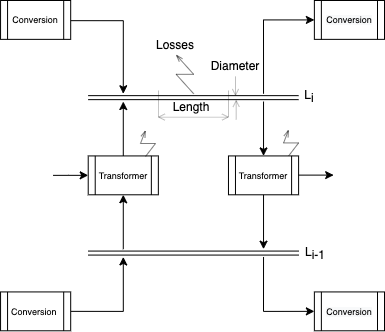
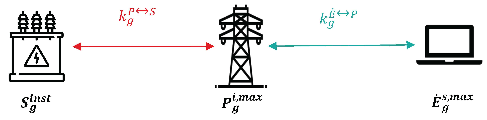
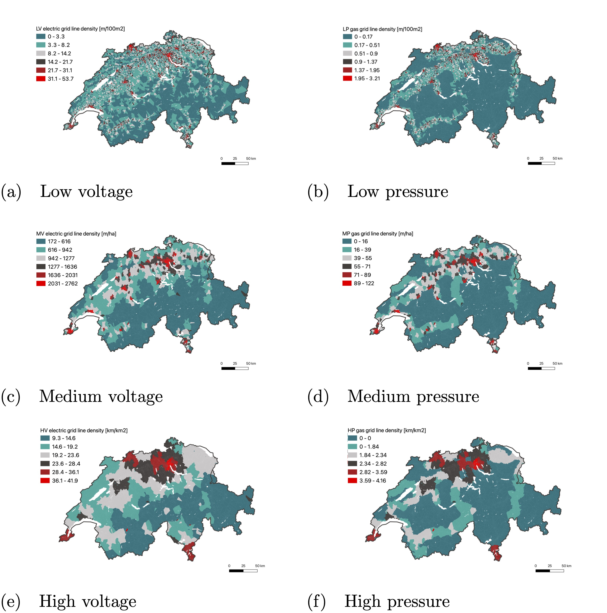
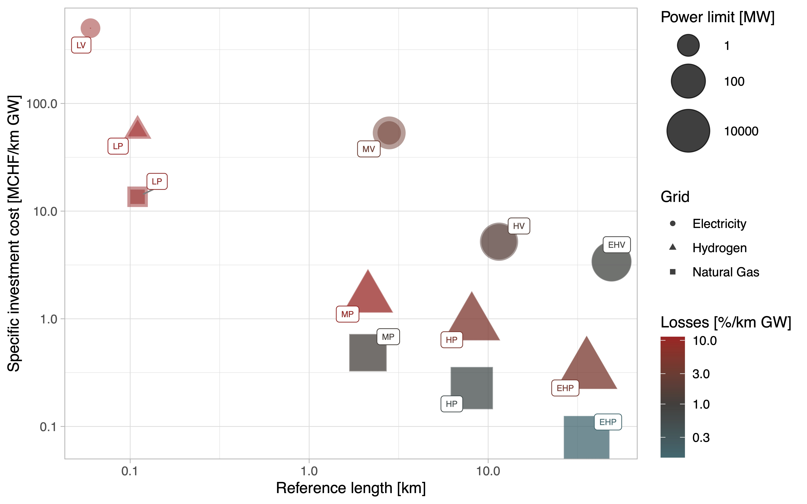
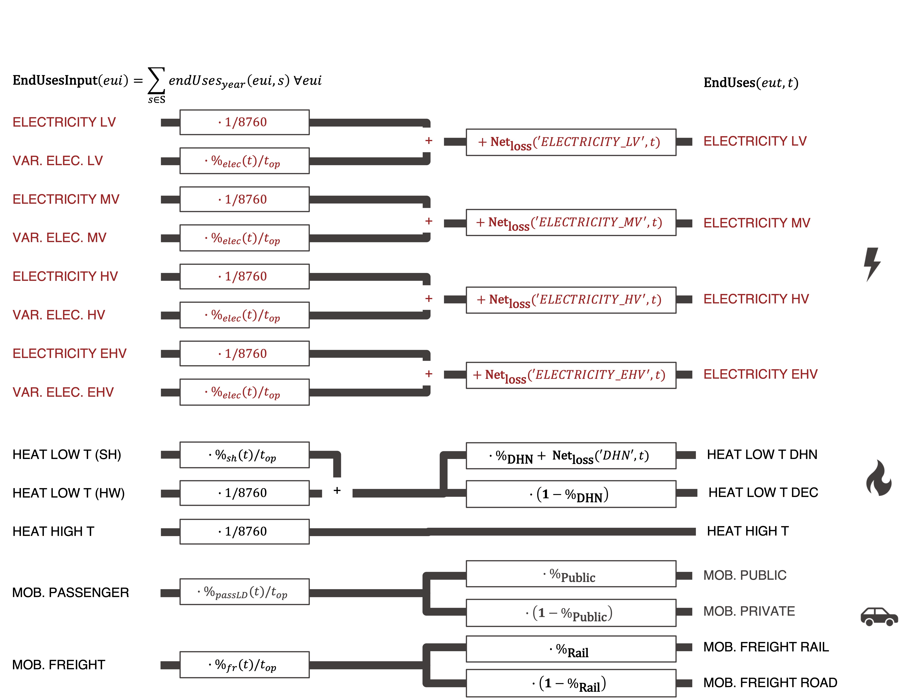
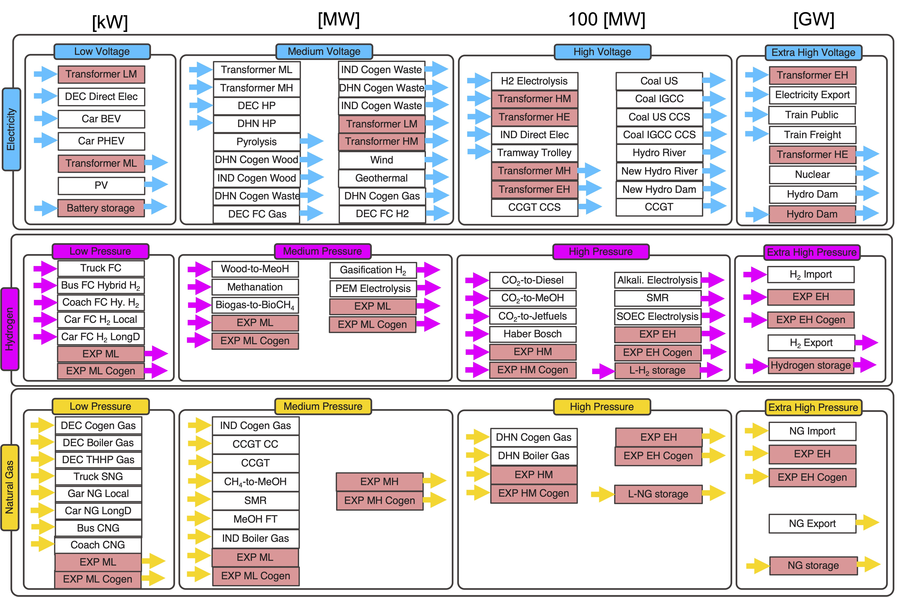

# Infrastructure

## Module Overview

!!! abstract
    This section provides an overview of how the **EnergyScope** model integrates energy infrastructure into the overall system analysis. Efficient energy transmission and storage infrastructures are essential for the deployment of renewable energy sources and for maintaining system stability. The module models different grid levels (electrical, methane, hydrogen) and evaluates the reinforcement and development needs to ensure reliable energy transmission, based on the following works:

!!! quote
    - On the role of energy infrastructure in the energy transition. Case study of an energy independent and CO2 neutral energy system for Switzerland, [Schnidrig 2023](https://doi.org/10.3389/fenrg.2023.1164813)

!!! info "Key Aspects of Infrastructure Modeling"
    - The categorization and modeling of different energy grids, including electrical, methane, and hydrogen grids.  
    - Evaluation of grid losses and the need for infrastructure reinforcement.  
    - Cost optimization for grid expansion and efficiency.  

---

## Grid Separation

Electrical, methane, and hydrogen infrastructures have been modeled, each split into four power levels (e.g., voltage in electric grids and pressure in gas grids), characterized by the distributed power capacity \( \mathbf{S_g}^{max} \;\mathrm{[GW^{inst}]} \), following the discretization of [Swissgrid 2020](https://doi.org/10.3389/fenrg.2020.549615) for the electric grid and [Swissgas 2018](https://doi.org/10.3389/fenrg.2020.549615) for the gas grid.

The conversion technologies, as producers or consumers, connect to predefined levels in the grid infrastructure. Transformers allow connections between different grids within the same infrastructure. For each grid, the length and capacity are calculated, defined as the maximum power it can transfer, which is converted into a diameter of pipe or cable to install. Each grid has a loss model representing distribution losses (see Figure 1). The infrastructure cost is calculated as a function of the installed capacity and the grid length. Additionally, transformation losses and energy recovery are considered for transformers. Table 1 presents the different grids considered in this study.

*Figure 1: Representation of the infrastructure with different levels.*

| **Grid Levels for Infrastructures** | Voltage/Pressure | Power [MW] | Length [km] |
|---|---|---|---|
| **Electricity Distribution Infrastructure** | | | |

| EHV | 300 kV | 1700 | 6700 |
| HV  | 93 kV  | 500  | 8900 |
| MV  | 18.5 kV | 30   | 43000 |
| LV  | 0.05 kV | 0.3  | 130000 |
| **Methane Distribution Infrastructure** | | | |
| EHP | 80 barg  | 51500 | 710  |
| HP  | 30 barg  | 6140  | 940  |
| MP  | 7.5 barg | 425   | 4350 |
| LP  | 0.0625 barg | 0.425 | 9700 |
| **Hydrogen Distribution Infrastructure** | | | |
| EHP | 80 barg  | 12133 | -    |
| HP  | 30 barg  | 1557  | -    |
| MP  | 7.5 barg | 132   | -    |
| LP  | 0.0625 barg | 0.2 | -    |

*Table 1: Grid levels considered for the different infrastructures. Power refers to the typical size of the technologies to be connected to the grid level, length refers to the grid length for the corresponding level.*

## Grid Characterization
### Resolution Differences

Energy system modeling involves creating digital twins of energy systems by integrating technical and economic assumptions. The link from the real-world dimension to the model is determined by integrating scaling factors \( \mathbf{k_g^{i \leftrightarrow j}} \) (see Figure 2). The relationship between the real-world installation and the observed power \( \mathbf{k_g^{P \leftrightarrow S}} \) corresponds to the security coefficient used by engineers when determining transformer size \( \mathbf{S_g^{inst}} \), based on the observed maximum power in the grid \( P_g^i \). This observed power can be modeled within the energy system digital twin \( \mathbf{\dot{E}_g^s} \), which is linked to the grid's maximum power \( \mathbf{P_g} \) through scaling factors \( \mathbf{k_g^{P \leftrightarrow S}} \).

\[
\mathbf{S_g^{inst}} = \mathbf{k_g^{\dot{E} \leftrightarrow P}} \cdot \mathbf{k_g^{P \leftrightarrow S}} \cdot \mathbf{\dot{E}_g^s}
\]

The scaling factors are determined using historical data. The observed power is expressed as a 15-minute average power, and the temporal resolution between observed and modeled power varies for transmission and distribution grids, summarized as a continuous uniform distribution \( 2^{+0.76}_{-0.11} \), and included in sensitivity analysis.

*Figure 2: Installation size \( \mathbf{S_g^{inst}} \;\mathrm{[GW^{inst}]} \), observed power \( \mathbf{P_g} \;\mathrm{[GW^{15min}]} \), and modeled power \( \mathbf{\dot{E}_g^s} \;\mathrm{[GW^{TP}]} \) linking procedure with scaling factors \( \mathbf{k_g^{\dot{E} \leftrightarrow P}} \) and \( \mathbf{k_g^{P \leftrightarrow S}} \).*

### Specific Length

The specific length corresponds to the average grid length between two conversion stations at the same power level. It depends on the distribution density and power. For each type of grid, a reference distribution length \( \mathbf{l_g^{ref}} \) is determined by:

\[
\mathbf{l_g^{ref}} = \frac{\mathbf{l_g^{tot}}}{\mathbf{n_g}}, \quad \forall g \in \mathcal{GRIDS}
\]

Where:  

- \( \mathbf{l^{ref}_{g}} \) = Mean grid length,  
- \( \mathbf{l^{tot}_{g}} \) = Total grid length,  
- \( \mathbf{n_{g}} \) = Number of consumers in the grid.  

For the electric grid, total grid length and number of conversion stations are obtained from [Gupta et al. 2021](https://doi.org/10.3389/fenrg.2020.549615), allowing the calculation of specific length \( \mathbf{l_g^{ref}} \) using:

\[
\mathbf{l^{ref}_g} = \frac{\sum_i l_{g,i}^{tot}}{\sum_i n_{g,i}}, \quad \forall i \in \mathcal{POLYGONS}, g \in \mathcal{GRIDS}
\]

For gas grids, a similar approach is applied, with the total lengths and grid configuration validated against reported lengths.

*Figure 4: Map of Switzerland with the grid line density estimation using the equidistant method for electric and gas grids.*

### Losses

Each grid \( g \) is characterized by a reference length \( \mathbf{l_g^{ref}} \) and the power capacity \( \mathbf{S_g^{max}} \). The specific loss coefficients \( \mathbf{\eta_g^{loss}} \;\mathrm{[\frac{\%}{GW \cdot km}]} \) represent the losses for each grid. Losses are calculated using:

\[
\mathbf{\dot{E}_g^{loss}} = \mathbf{\eta_g^{loss}} \cdot \mathbf{l_g^{ref}} \cdot \mathbf{\dot{E}_g^s}, \quad \forall g \in \mathcal{GRIDS}
\]

Where:  

- \( \mathbf{\dot{E}_g^{loss}} \) = Losses,  
- \( \mathbf{\eta_g^{loss}} \) = Specific loss coefficients,  
- \( \mathbf{l_g^{ref}} \) = Grid reference length,  
- \( \mathbf{\dot{E}_g^{s}} \) = Power used.  

### Costs

The investment costs of the grid \( \mathbf{C_g^{inv}} \;\mathrm{[MCHF]} \) depend on the grid length and power capacity:

\[
\mathbf{C_g^{inv}} = \mathbf{S_g^{inst}} \cdot \mathbf{c_g^{inv}} \cdot \mathbf{l_g^{inst}}, \quad \forall g \in \mathcal{GRIDS}
\]

Where:

- \( \mathbf{C_g^{inv}} \) = Investment costs,  
- \( \mathbf{c_g^{inv}} \) = Specific investment costs,  
- \( \mathbf{S_g^{inst}} \) = Installed size,  
- \( \mathbf{l_g^{inst}} \) = Installed grid length.  

### Grid Comparisons

The characterization of the technologies is summarized in Figure 5. Each grid is split into four power levels on a logarithmic scatter plot. All grids follow similar power levels and reference lengths, though key distinctions exist.

The installed power limit \( S^{inst} \) is higher for gas grids compared to electric grids. The energy transportation capacity of the methane grid is up to 30 times greater than the electricity grid at the same power level, which results in higher energy density per unit length. Consequently, the hydrogen grid has a lower energy-specific investment cost but higher energy density per grid unit length than the electric grid. 

The power limits directly impact specific costs. While the electric grid is more expensive than gas grids, the energy density of methane grids makes them more cost-effective, especially in the distribution network. Gas grids also have lower losses compared to the electric grid, though the hydrogen grid requires more energy due to compression demands.

*Figure 5: Grid infrastructure techno-economic characterization of electricity (circles), hydrogen (triangles), and methane (squares) grids split into four power levels (extra high, high, medium, low pressure/voltage).*

## Linear Programming Model Formulation

This methodology is integrated into **EnergyScope**, a fast-solving energy system model expressed as a Mixed Integer Linear Programming (MILP) model based on energy and mass balances. The decision variables for technology installation size \( \mathbf{F} \; \mathrm{[GW]} \) and use \( \mathbf{F_t} \;\mathrm{[\frac{GW \cdot t_{TP}}{t_{TP}}]} \) are optimized under different objective functions, subject to environmental, economic, and technical constraints.

### Infrastructure Design and Operation

The necessary infrastructure type \( g \in \mathcal{GRIDS} \), size \( \mathbf{F} \), and operation \( \mathbf{F_t} \) are determined by the grid-specific energy layers \( l(g) \in \mathcal{E-LAYERS} \) produced by the technologies \( tec \in \mathcal{TECHNOLOGIES} \). The grid operation in each period \( t \) is calculated by summing the grid-layer-specific outputs of all technologies:

\[
\mathbf{F_{t}}(g,t) \geq \sum_{tec} \mathbf{F_t}(tec,t) \cdot \mathbf{\eta_{out}}(tec,l(g)) \cdot \frac{1}{\mathbf{n}(g)}, \quad \forall g \in \mathcal{GRIDS}(l), \: t\in\mathcal{PERIODS}, \: tec \in \mathcal{TEC}
\]
The maximum grid operation size across all periods determines the grid installation size:

\[
\mathbf{F}(g) \geq \mathbf{F_{t}}(g,t), \quad \forall g \in \mathcal{GRIDS}, \: t\in\mathcal{PERIODS}
\]

Grid power loss is modeled by multiplying grid operation with reference length \( l_{ref}(g) \) and specific loss coefficient \( \eta_{Loss}(g) \):

\[
\mathbf{F_{t}^{Loss}}(g,t) = \mathbf{F_{t}}(g,t) \cdot \mathbf{\eta_{Loss}}(g) \cdot \mathbf{l_{ref}}(g), \quad \forall g \in \mathcal{GRIDS}, \: t\in\mathcal{PERIODS}
\]

### Energy Balance and Demand Satisfaction

The global annual energy demands are split into households, services, industry, and mobility sectors. These demands are categorized into electricity (four voltage levels), space heating, hot water, process heat, passenger transport, and freight transport (see Figure 6). The end-use demands \( \mathbf{END \, USES} \) are satisfied by energy conversion technologies, storage, and grid losses:

\[
\mathbf{END \, USES}(l,t) = \sum_{i \in \mathcal{RES \cup TEC}} \mathbf{F_t}(i,t) \cdot \mathbf{\eta}(i,l) - \mathbf{F_t^{Loss}}(l,t) + \sum_{j \in \mathcal{STO \; TEC}} (\mathbf{Sto_{out}}(j,l,t) - \mathbf{Sto_{in}}(j,l,t)), \quad \forall l, t
\]

*Figure 6: Separation and allocation of annual demand into sectoral demands (electricity, heat, and mobility) over time.*

*Figure 7: Categorization of energy conversion technologies for electricity, methane, and hydrogen networks.*

### Cost and Objective Function

The total cost function \( \mathbf{C_{tot}} \) is composed of investment, maintenance, and operating costs, including grid-specific costs:

\[
\mathbf{C_{tot}} = \sum_{tec} (\mathbf{C_{inv}}(tec) \cdot \mathbf{\tau}(tec) + \mathbf{C_{maint}}(tec)) + \sum_{res} \mathbf{C_{op}}(res) + \sum_{g} (\mathbf{C_{inv}}(g) \cdot \mathbf{\tau}(g))
\]

Where:

- \( \mathbf{C_{inv}}(tec) = c_{inv}(tec) \cdot (\mathbf{F}(tec) - f_{ext}(tec)) \),  
- \( \mathbf{C_{maint}}(tec) = c_{maint}(tec) \cdot \mathbf{F}(tec) \),  
- \( \mathbf{C_{op}}(res) = \sum_{t} c_{op}(res) \cdot \mathbf{F_t}(res,t) \cdot t_{op}(t) \).

Grid investment cost \( \mathbf{C_{inv}}(g) \) is calculated by multiplying the specific investment cost with necessary grid reinforcement:

\[
\mathbf{C_{inv}}(g) = c_{inv}(g) \cdot (\mathbf{F}(g) - f_{ext}(g)) \cdot \mathbf{l^{ref}}(g) \cdot \mathbf{k^{\dot{E} \leftrightarrow P}}(g) \cdot \mathbf{k^{P \leftrightarrow S}}(g)
\]

## Validation

By characterizing infrastructure losses and costs, the model is validated using the Swiss energy system of 2020 as a reference. The recreated 2020 energy system configuration allows comparison of simulated and reported economic and loss values. Electric infrastructure investment costs were found to differ by only 11.7% from observed values. Similarly, grid losses were simulated to be 6.63% lower than reported electricity losses.

## Uncertainty

To account for uncertainties in modeling and grid characterization, a quasi-Monte-Carlo simulation is applied to assess the configuration space \( \mathcal{F} \):

\[
\langle \mathcal{F} \rangle \approx \frac{1}{N} \sum_{i=1}^N \mathcal{F}(x_i)
\]

Each configuration \( f^s(x_i) \) is calculated according to the economic optimization problem, where the \( x_i \) are selected using a Sobol sequence.

