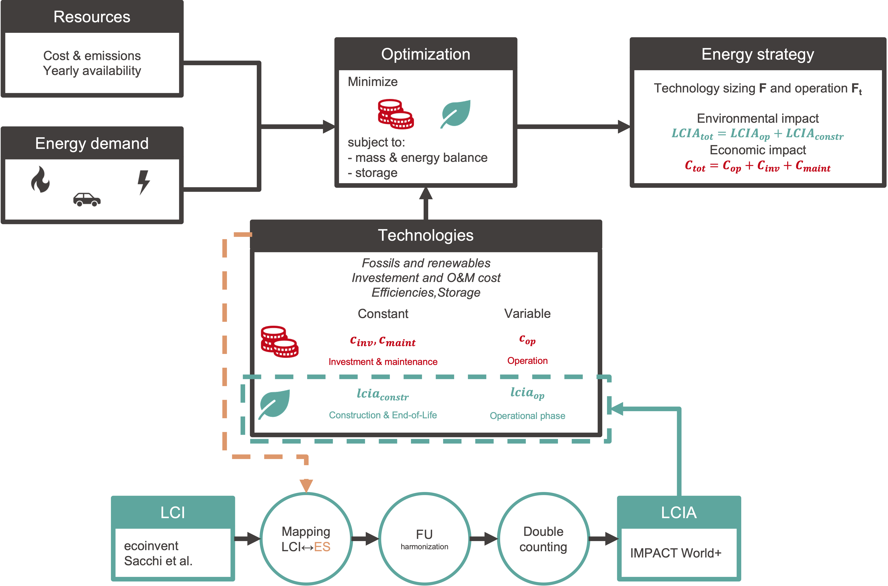

# LCA

## Module Overview

!!! abstract
    This section provides an overview of how the **EnergyScope** model integrates **Life Cycle Assessment (LCA)** into the overall system analysis. LCA is crucial in evaluating the environmental impacts of energy technologies across their entire life cycle, from construction and operation to decommissioning. The module helps balance economic optimization with environmental sustainability, focusing on avoiding environmental burden-shifting, based on the following work:

!!! quote
    - "Between Green Hills and Green Bills: Unveiling the Green Shades of Sustainability and Burden Shifting through Multi-Objective Optimization in Swiss Energy System Planning" [Schnidrig, Souttre, Chuat et al., 2023](https://doi.org/10.48550/arXiv.2402.12973)

!!! info "Key Aspects of LCA Modeling"
    - Integration of LCA indicators (e.g., carbon footprint, fossil and nuclear energy use) into the **EnergyScope** model's optimization framework.  
    - Tailored LCA characterization for Swiss energy systems to assess the environmental and economic trade-offs in renewable energy transitions.  
    - Multi-Objective Optimization (MOO) to balance environmental and economic objectives while minimizing risks of burden-shifting across different environmental impact categories.  

Based on the methodology from the provided document, here is the complete **Life Cycle Assessment (LCA) Module** for the **EnergyScope** model, extracted from the methods section of the study. It follows the structure and style of previous modules like **Mobility** or **Typical Days**:

## Modeling Framework

This work builds on exploratory research integrating Life Cycle Assessment (LCA) into the pre-existing Mixed Integer Linear Programming (MILP)-based EnergyScope framework, a model initially formulated by Moret et al. and continuously improved by Li et al., and Schnidrig et al.

The *EnergyScope* framework represents a comprehensive multi-energy model evaluated on a monthly averaged basis. It ensures balanced mass and energy conservation between demands and resources. Demand is segmented into sectors such as households, services, industry, and transportation, and further categorized by energy types to create a more precise breakdown. The key decision variables are represented by the installed size \( \mathbf{F} \) and use \( \mathbf{F_t} \) of technologies.

## Economic Objective

Central to the primary objective function (OF) of EnergyScope is the total cost \( \mathbf{C_{tot}} \), defined as the sum of the annualized technology-specific investment cost \( \mathbf{C_{inv}} \), maintenance cost \( \mathbf{C_{maint}} \), and operational cost \( \mathbf{C_{op}} \) of resources:

\[
\mathbf{C_{tot}} = \sum_{tec} \left( \mathbf{C_{inv}}(tec) \cdot \mathbf{\tau} (tec) + \mathbf{C_{maint}}(tec) \right) + \sum_{res} \mathbf{C_{op}}(res)
\]

Where:

- \( \mathbf{C_{inv}}(tec) = c_{inv}(tec) \cdot (\mathbf{F}(tec) - f_{ext}(tec)) \)  
- \( \mathbf{C_{maint}}(tec) = c_{maint}(tec) \cdot \mathbf{F}(tec) \)  
- \( \mathbf{C_{op}}(res) = \sum_{t} c_{op}(res) \cdot \mathbf{F_t}(res,t) \cdot t_{op}(t) \)  

With:

- \( tec \in \mathcal{TEC} \) (technologies),  
- \( res \in \mathcal{RES} \) (resources),  
- \( t \in \mathcal{PERIODS} \) (time periods).  

## LCA Objectives

The environmental objective function \( \mathbf{LCIA_{tot}}(i) \) assesses the sum of life cycle impacts of a technology throughout its construction, operation, and end-of-life for the different LCA indicators \( i \).

### Constant Impact

The LCA impact score \( \mathbf{LCIA_{stat}} \) calculates the annualized impact score of the technology over its useful lifetime, encompassing its construction and end-of-life. It is calculated by multiplying the installed technology size \( \mathbf{F} \) with the specific impact factor \( lcia_{stat} \), divided by the technology's useful lifetime:

\[
\mathbf{LCIA_{stat}}(i,tec) = lcia_{stat}(i,tec) \cdot \mathbf{F}(tec) \cdot \frac{1}{{n}(tec)}
\]

### Variable Impact

The variable LCA impact score \( \mathbf{LCIA_{var}} \) represents the impacts generated during the operation of the technology. It is calculated by multiplying the annual use of the technology with the specific operational impact factor \( lcia_{var} \):

\[
\mathbf{LCIA_{var}}(i,tec) = lcia_{var}(i,tec) \cdot \sum_{t} \mathbf{F_t}(tec,t) \cdot t_{op}(t)
\]

The total LCA impact is then given by:

\[
\mathbf{LCIA_{tot}}(i) = \sum_{tec} \left( \mathbf{LCIA_{stat}}(i,tec) + \mathbf{LCIA_{var}}(i,tec) \right)
\]

Where:

- \( i \in \mathcal{INDICATORS} \),  
- \( tec \in \mathcal{TEC} \),  
- \( t \in \mathcal{PERIODS} \).  

## LCA-Database

### Mapping of Technologies with Life-Cycle Inventory Datasets

The systematic integration of LCA into the EnergyScope framework involves mapping 216 energy conversion and storage technologies to corresponding technologies in LCA databases. Each technology is divided into a constant life cycle stage (covering construction and decommissioning) and a variable stage (operations and maintenance).

### Harmonization of EnergyScope and LCA Data

To harmonize the data between EnergyScope and LCA databases, conversion factors are applied to standardize impact measurements. This results in the transformation matrix \( T \), which converts the energy system's input data into a format compatible with the LCA databases.

### Double-Counting Removal

Double-counting removal identifies and nullifies redundant flows within the integrated system by comparing the input flows from EnergyScope with the corresponding variable flows from the LCA database. The result is an adjusted technology matrix \( A^{*} \), ensuring accurate impact calculations.

### Life-Cycle Impact Assessment

The life-cycle impact assessment (LCIA) is based on the impact assessment matrix \( C \), which assigns characterization factors for specific impact categories, including carbon footprint, fossil energy use, and water scarcity. The environmental impact scores for each technology are calculated as follows:

\[
h_j = C \cdot B \cdot (A^{*})^{-1} \cdot f_j
\]

Where \( f_j \) is the final demand vector for each technology phase.

## Multi-Objective Optimization

Multi-objective optimization (MOO) addresses scenarios where multiple objectives, such as cost and environmental impact, need to be optimized simultaneously. In this research, LCIA objectives \( l \in \mathcal{LCIA-I} \subset \mathcal{OF} \) are incorporated as constraints during economic optimization.

The objective function for minimizing total cost is:

\[
\min_{\mathbf{F}, \mathbf{F_t}} \mathbf{C_{tot}}
\]

Subject to:

\[
\mathbf{f_{obj}}(i) \leq \omega(i) \cdot f_{obj}^{\max}(l) + (1 - \omega(i)) \cdot f_{obj}^{\min}(l)
\]

Where:

- \( i \in \mathcal{OF} = \mathcal{COST} \cup \mathcal{LCIA-I} \),  
- \( \omega \) represents the weight of each objective.  

To explore the solution space, the quasi Monte-Carlo method (Sobol) is used to sample weights \( \omega(i) \), ensuring a thorough exploration of the trade-offs between the different objectives.
