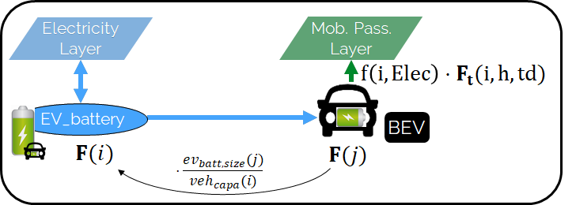

# Mobility

## Module Overview

!!! abstract 
    This section provides an overview of how the **EnergyScope** model integrates mobility into the overall energy system analysis. As transportation accounts for a significant share of energy consumption and emissions, modeling the transition towards greener mobility options, such as electric vehicles (EVs), hydrogen fuel cell vehicles, and alternative fuel technologies, is critical to understanding the impact on the entire energy system, based on the following works

!!! quote
    - Assessment of green mobility scenarios on European energy systems, [Schnidrig 2020](https://infoscience.epfl.ch/entities/publication/aa5cf738-10cc-4fbd-94ff-62a30998190a)
    - A modelling framework for assessing the impact of green mobility technologies on energy systems, [Schnidrig 2021](https://infoscience.epfl.ch/entities/publication/d521fe41-b873-46da-b4b3-8d31938d3df5)
    - An analysis of the impacts of green mobility strategies and technologies on different European energy system, [Ngyuen 2021](https://infoscience.epfl.ch/entities/publication/bf57ffc4-51fb-4f31-822c-ee51ceb79e39)

!!! info "Key Aspects of Mobility Modeling"  
    - Hourly mobility demand projections, based on real-world traffic data and future socioeconomic indicators.  
    - Integration of various green mobility technologies, such as battery electric vehicles (BEVs), fuel-cell vehicles (FCVs), and vehicles powered by biofuels or synthetic fuels.  
    - Charging infrastructure and strategies for electric vehicles, including smart charging systems and vehicle-to-grid (V2G) capabilities.  

---

## Electric Vehicle Integration

The **EnergyScope** model captures the dynamics of electric vehicles (EVs) in terms of energy demand and storage potential. By considering EVs as both consumers and potential providers of electricity (through V2G technologies), the model assesses the flexibility that large-scale EV deployment can provide to the electricity grid.

### Electric Vehicle Storage

The model calculates the total storage capacity of electric vehicles by considering the fleet size, the specific energy per vehicle, and the number of vehicles in circulation. The energy stored in the batteries of V1G vehicles (vehicles that only consume electricity) is used solely for mobility, while V2G vehicles can discharge stored electricity back to the grid during peak hours or when needed.

$$
F(b) = \frac{F(v) \cdot e_{vehicle}(v)}{f_{car, circulation} \cdot P_{Car}(v)}
$$

This formulation represents the storage capacity of the vehicle fleet \( F(b) \), based on the number of vehicles in use and their energy demands.

---

## Peak Demands and Charging Strategies

The electrification of mobility leads to significant loads on the energy system, particularly during peak charging periods. To address this, the **EnergyScope** model includes smart charging strategies aimed at flattening the peak demands and optimizing charging times based on system-wide electricity demand. Two key charging strategies are implemented:

1. **Avoiding Peak Hours**: The model prevents vehicle charging during hours when electricity demand is highest, helping to reduce stress on the grid.  
2. **Energy Storage Regulation**: Charging is regulated to ensure that vehicles discharge and charge in a balanced manner, avoiding unnecessary cycling of energy.

These strategies help mitigate the volatility and spikes in energy demand due to the simultaneous charging of a large number of electric vehicles.

---

## Charging Infrastructure

In addition to vehicle modeling, **EnergyScope** considers the infrastructure required for charging electric vehicles. The charging process is modeled to include interactions between the grid and charging stations. The model also takes into account the availability and capacities of different types of charging stations, as well as the power transfer needed for effective charging.

$$
\sum_c F_t(c,h,td) \cdot top = \sum_b StoIn(b,Elec,h,td) \cdot top(h,td)
$$

This equation illustrates the balance between electricity supplied to charging stations and the energy transferred into EV batteries, ensuring that the energy system can meet the charging needs.

---

## Vehicle-to-Grid

$$
\textbf{F} (i) = \frac{\textbf{F} (j)}{ veh_{capa} (j)} ev_{batt,size} (j)  ~~~~~~ \forall  j \in  V2G, i \in \text{EVs BATT OF V2G}(j)
$$

Vehicle-to-grid dynamics are included in the model via the *V2

G* set. For each vehicle $j \in V2G$, a battery $i$ ($i \in EVs BATT$) is associated using the set $EVs\_BATT\_OF\_V2G$ ($i \in \text{EVs\_BATT\_OF\_V2G}(j)$). Each type $j$ of *V2G* has a different size of battery per car ($ev_{batt,size}(j)$), e.g., the first generation battery of the Nissan Leaf (ZE0) has a capacity of 24 kWh. The number of vehicles of a given technology is calculated with the installed capacity (**F**) in [km-pass/h] and its capacity per vehicle ($veh_{capa}$ in [km-pass/h/veh.]). Thus, the energy that can be stored in batteries **F**\ ($i$) of *V2G*\ ($j$) is the ratio of the installed capacity of vehicle by its specific capacity per vehicle times the size of battery per car ($ev_{batt,size}(j)$), as shown in the equation. As an example, if this technology of cars covers 10 Mpass-km/h, and the capacity per vehicle is 50.4 pass-km/car/h (which represents an average speed of 40km/h and occupancy of 1.26 passengers per car), then the number of BEV cars is 0.198 million cars. And if a BEV has a 24kWh of battery, such as the Nissan Leaf (ZE0), then the equivalent battery has a capacity of 4.76 GWh.

$$
\textbf{Sto}_\textbf{out} (j,Elec,h,td) \geq - f(i,Elec) \textbf{F}_\textbf{t} (i,h,td) 
$$

$$
\forall i \in V2G , \forall j \in \text{EVs BATT OF V2G}(j), \forall h \in H, td \in TD 
$$

The equation forces batteries of electric vehicles to supply, at least, the energy required by each associated electric vehicle technology. This lower bound is not an equality; in fact, according to the V2G concept, batteries can also be used to support the grid. The figure shows through an example with only BEVs how the equation simplifies the implementation of V2G. In this illustration, a battery technology is associated with a BEV. The battery can either supply the BEV needs or send electricity back to the grid.

$$
\textbf{Sto}_\textbf{in} (j,l,h,td)t_{sto_{in}}(\text{j}) + \Big(\textbf{Sto}_\textbf{out}(j,l,h,td) + f(i,Elec) \textbf{F}_\textbf{t} (i,h,td) \Big) \cdot t_{sto_{out}}(\text{j})
$$

$$
\leq \Big( \textbf{F} (j) - \frac{\textbf{F} (j)}{ veh_{capa} (j)} ev_{batt,size} (j) \Big) \cdot \%_{sto_{avail}}(j)
$$

$$
\forall i \in V2G , \forall j \in \text{EVs BATT OF V2G}(j) , \forall l \in L, \forall h \in H, \forall td \in TD
$$

The equation limits the availability of batteries to the number of vehicles connected to the grid. This equation is similar to the one for other types of storage; except that a part of the batteries is not accounted, i.e., the one running. Therefore, the available output is corrected by removing the electricity powering the running car (here, $f(i,Elec) \leq 0$) and the available batteries are corrected by removing the numbers of electric cars running ($\frac{\textbf{F} (j)}{ veh_{capa} (j)} ev_{batt,size} (j)$).

$$
\textbf{Sto}_\textbf{level} (j,t) \geq \textbf{F}[i] soc_{ev}(i,h)
$$

$$
\forall i \in V2G , \forall j \in \text{EVs BATT OF V2G}(j) , \forall t \in T| \{h,td\} \in T\_H\_TD
$$

For each electric vehicle ($ev$), a minimum state of charge is imposed for each hour of the day ($soc_{ev}(i,h)$). As an example, we can impose that the state of charge of EV is 60% in the morning, to ensure that cars can be used to go to work. The equation imposes, for each type of $V2G$, that the level of charge of the EV batteries is greater than the minimum state of charge times the storage capacity.

## Mobility Technologies

The **EnergyScope** model integrates a wide range of mobility technologies, including:

- **Battery Electric Vehicles (BEVs)**: Representing the most environmentally optimal solution for passenger and freight mobility, BEVs reduce greenhouse gas emissions but increase electricity demand.  
- **Fuel Cell Vehicles (FCVs)**: Competing with BEVs in terms of environmental performance, FCVs rely on hydrogen produced through electrolysis or natural gas reforming, offering an alternative to battery storage.  
- **Internal Combustion Engine Vehicles (ICEVs)**: Vehicles powered by synthetic and biofuels are modeled as less efficient alternatives, though they provide energy independence from the electricity grid.

---

## Infrastructure and Alternative Fuels

In addition to the vehicle technologies, **EnergyScope** models the infrastructure required to support different types of mobility. This includes the deployment of charging stations, hydrogen refueling stations, and biofuel production facilities. The cost and efficiency of these infrastructures are included in the overall system optimization.

By integrating both the vehicle technologies and the supporting infrastructure, **EnergyScope** provides a comprehensive view of how different mobility pathways influence the energy system.
