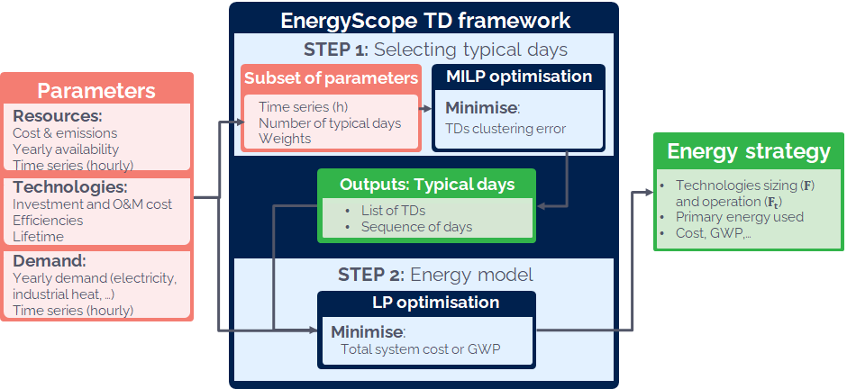
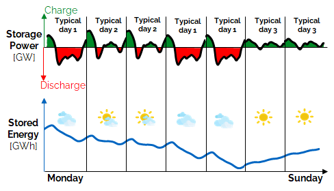
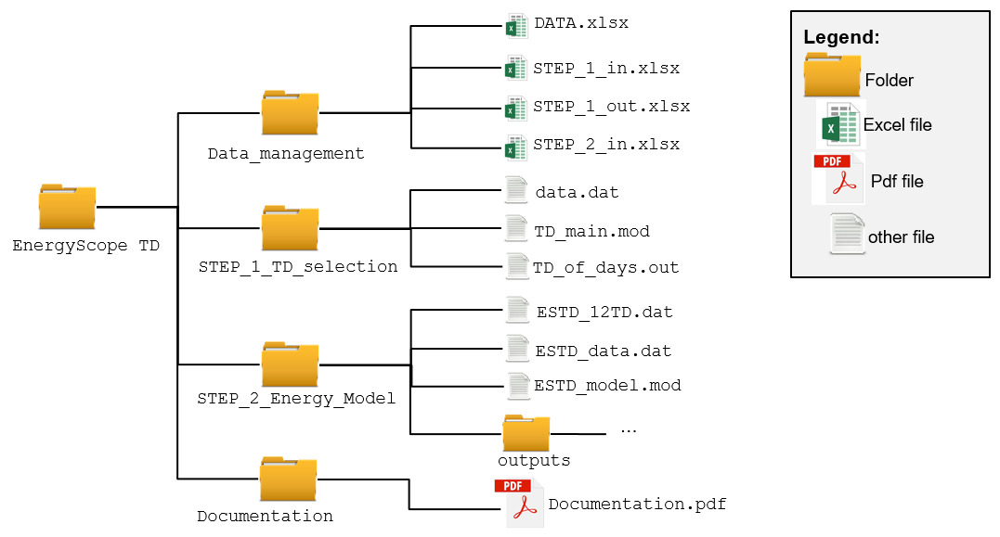

# Typical Days

## Module Overview

!!! abstract
    This section provides an overview of how the **EnergyScope** model integrates the **Typical Days** approach into the energy system analysis. The **Typical Days (TD)** module reduces the computational complexity by selecting representative days from the 8760 hours of a year, enabling faster simulations while maintaining accuracy in energy system optimization, based on the following works:

!!! quote
    - EnergyScope TD: A novel open-source model for regional energy systems, [Limpens 2019](https://doi.org/10.1016/j.apenergy.2019.113729)

!!! info "Key Aspects of Typical Days Modeling"
    - Selection of representative days to reduce computational time while maintaining system accuracy.  
    - Evaluation of clustering methods for identifying the most relevant typical days.  
    - Use of reconstruction methods to overcome limitations in long-term storage modeling and seasonal variations.  

Energy system models often face significant computational challenges, especially when trying to optimize energy flows for every hour of the year (8760 hours). Running such high-resolution models can be computationally prohibitive. For example, running a detailed simulation for 8760 hours can take over 19 hours, whereas the **Typical Days (TD)** approach reduces this time to approximately 1 minute. The TD module offers a trade-off between computation time and accuracy by approximating the system with a small subset of representative days, known as Typical Days.

The TD approach consists of two independent steps:

- **Step 1**: Pre-process the time series data and solve a **Mixed Integer Linear Programming (MILP)** problem to determine the appropriate set of Typical Days.
- **Step 2**: Use the selected Typical Days in the main energy model to optimize the design and operation of the energy system, including technology selection, sizing, and operation for a target future year.

These two steps are usually computed separately. The first step is performed once for a given energy system using specific weather data, while the second step can be computed multiple times for different scenarios. The figure below illustrates the overall structure of this process.

This documentation builds on prior research ([Moret2017PhDThesis](https://doi.org/10.5075/EPFL-THESIS-7961), [Limpens2019](https://doi.org/10.1016/j.apenergy.2019.113729), [Limpens2021thesis](https://doi.org/10.13140/RG.2.2.25755.18724)). For detailed information on the clustering methods, research approach, and reconstruction techniques, refer to [Limpens2021thesis](https://doi.org/10.13140/RG.2.2.25755.18724).

---

## Typical Days Selection

One of the main advantages of using **Typical Days** is the drastic reduction in computational time. Instead of optimizing over the full 8760 hours of the year, **TD** reduces this to a much smaller subset, typically between 6 and 20 representative days, depending on the study ([Gabrielli2018](https://doi.org/10.1016/j.apenergy.2017.12.070), [Despres2017](https://doi.org/10.1016/j.eneco.2016.03.006), [Nahmmacher2014](https://doi.org/10.1016/j.energy.2016.06.081), [Pina2013](https://doi.org/10.1016/j.apenergy.2013.05.074)).

### Clustering Methods

In prior research ([Limpens2019](https://doi.org/10.1016/j.apenergy.2019.113729)), 12 **Typical Days** were found to be appropriate for the **EnergyScope** model. The comparison between clustering algorithms demonstrated that the method proposed by [Dominguez-Munoz2011](https://doi.org/10.1016/j.enbuild.2011.07.024) performed best.

!!! warning
    A small error was found in the distance metric used for the clustering method. This error has since been corrected, and its impact on previous results has been determined to be negligible. A detailed explanation is provided in the file `Erratum_STEP_1.pdf`.

### Implementing Seasonality with Typical Days

While **Typical Days** offer significant computational advantages, they also introduce limitations. One notable limitation is the inability to model inter-day or seasonal storage, as the selected representative days do not capture consecutive day dynamics. This can limit the model's ability to fully account for long-term storage, which is critical for carbon-neutral energy systems.

To address this, **EnergyScope** implements a method proposed by [Gabrielli2018](https://doi.org/10.1016/j.apenergy.2017.12.070) that reconstructs the year based on the **Typical Days** by creating sequences of these days. This method allows for the optimization of energy storage levels over the full 8760 hours while maintaining computational efficiency.

With 12 Typical Days, key performance indicators (KPIs) such as cost, emissions, installed capacity, and primary energy usage are well captured. However, long-term storage capacities may be slightly underestimated, with a maximum deviation factor of two, as demonstrated in previous work ([Limpens2019](https://doi.org/10.1016/j.apenergy.2019.113729)).

---

## Implementation

The **EnergyScope TD** module is implemented in a structured repository containing four main components:

1. **Documentation**: Guides and manuals to help users navigate the model.
2. **Data Management**: The datasets used for the simulations, including weather data, technology costs, and energy demands.
3. **STEP_1_TD_selection**: The first step, which involves selecting the **Typical Days** by solving a **MILP** problem.
4. **STEP_2_Energy_Model**: The second step, which uses the selected Typical Days in the energy model for system optimization.

For each step, the terms (sets, variables, and parameters), constraints, and the objective function are detailed in the corresponding `.mod` files. Numerical parameters are stored separately in `.dat` files, and the output data is saved as `.out` files or in a designated output folder.

An Excel interface is provided to visualize and manage the data. Users can generate and manipulate input and output data files using the provided Excel templates (`STEP_1_in.xlsx`, `STEP_1_out.xlsx`, and `STEP_2_in.xlsx`), and a user guide is included in the documentation to assist new users.

