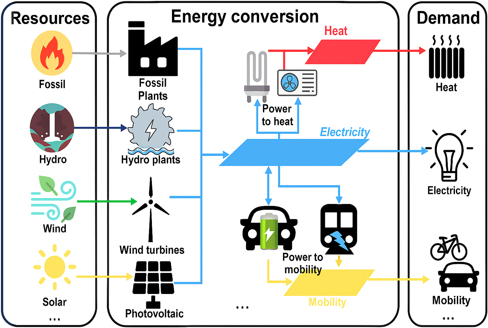

# EnergyScope: An Open-Source Whole-Energy System Modeling Framework

EnergyScope is an open-source, whole-energy system modeling framework that optimizes the design and operation of national or regional energy systems. It captures the major energy sectors of electricity, heating, mobility, and industry while accounting for both technological and environmental constraints. Developed for strategic planning, it supports policy and investment decisions by providing cost-optimal energy system configurations.

If you are new to EnergyScope and want to learn more check out the [Getting Started](./getting-started/index.md) page. If you'd like an overview of what EnergyScope has been used for, you can start from the [Model Versions](./models/index.md) page. We invite to join our [Community](./community/index.md)!

---

## Why Choose EnergyScope?

EnergyScope is a fast and concise energy model, particularly suitable for uncertainty quantification, scenario exploration, and what-if analyses.

- **⚡ Fast:** Solves complex energy models in seconds to minutes.
- **📦 Comprehensive:** Covers all major sectors (households, industry, transport, etc.) and energy carriers (electricity, heat, mobility, etc.).
- **🛠️ Easily Modifiable:** Direct access to model and data files makes it simple to add constraints, tweak parameters, or plug in custom features.
- **🚀 Quick to start:** Run your first model in minutes by visiting the [Getting Started](./getting-started/index.md) page.
- **📚 Peer-reviewed and validated:** Developed and used in [published research](./models/index.md) at leading institutions.
- **🌍 Open, accessible and flexible:** 100% open-source, modular, and backed by a vibrant [GitHub community](https://github.com/energyscope/EnergyScope).

---

## How to cite

For general reference to the EnergyScope project and the EnergyScope modeling framework, please cite [Limpens et al., 2019](https://doi.org/10.1016/j.apenergy.2019.113729).

For reference to specific model versions you can refer to the associated publications listed in the [Model Versions](./models/index.md) page.

---

## License

Originally licensed under the Apache 2.0 License: [Apache 2.0 License](https://www.apache.org/licenses/LICENSE-2.0)

Built with passion by the EnergyScope Community.
