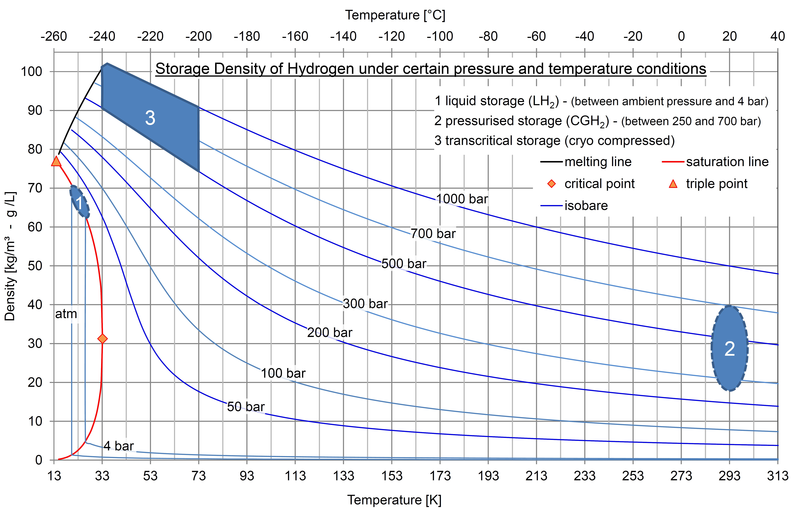

# Hydrogen Storage

## Introduction

Compared with NG storage, hydrogen storage consumes more energy due to its physical characteristics (see the figure
below). Methods of hydrogen storage for subsequent use span many approaches including high pressures, cryogenics, and
chemical compounds that reversibly release H2 upon heating. Underground hydrogen storage is useful to provide grid
energy storage for intermittent energy sources, like wind power, as well as providing fuel for transportation,
particularly for ships and airplanes.



## ES Model Integration

For H~2~ storage, the model considers the cavern storage with the investment cost 0.036 euro/kWh and operational cost 2%
of investment cost[^1].The CAPEX is derived from the storage volume of the cavern and the corresponding pressure
temperature and translated into energy unit based upon LHV of H~2~ (120 MJ/kg). H~2~ could also be stored in high
pressure steel tanks, but it is of small scale and only used for short terms storage, with investment cost 33.33
EUR/kWh. This method is not considered in Energyscope.

## ES Model Parameters

All the parameters concerning the H~2~ Storage are listed in the table
below.

```python exec="on"
from bibdatamanagement import *

print(MdDisplay.print_md_params(bib_file_path='docs/assets/ES_Canada_3.bib',filter_entry='H2_STO'))
```

## References

```python exec="on"
from bibdatamanagement import *

print(MdDisplay.print_md_sources(bib_file_path='docs/assets/ES_Canada_3.bib',filter_entry='H2_STO'))
```

[^1]: [ILK Dresden, Moritz Kuhn](http://www.ilkdresden.de/en/service/research-and-development/project/hydrogen-test-area-at-ilk-dresden/)
