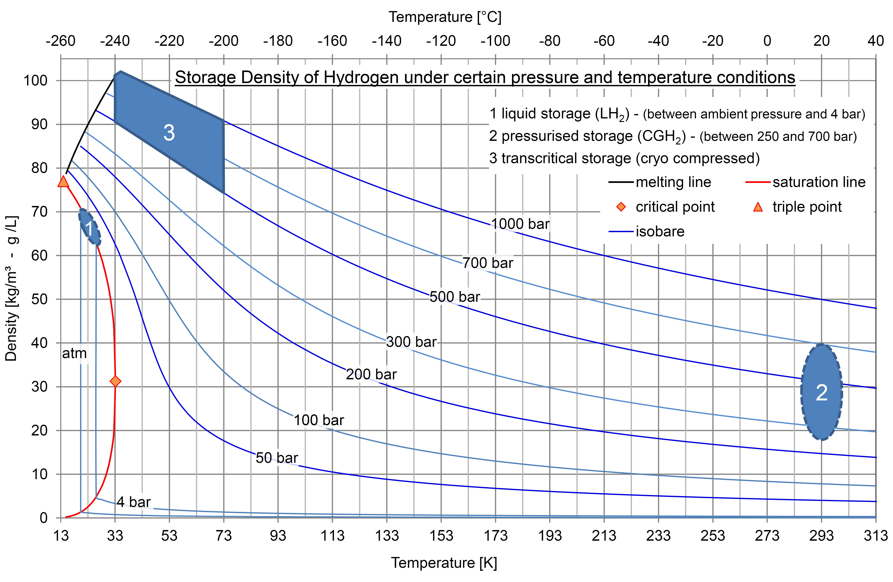

# Usage of Stored H~2~

## Introduction

This technology represents the release of stored hydrogen. This is the reverted technology
of [Hydrogen Storage](H2_STO.md)

Compared with
NG storage, hydrogen storage consumes more energy due to its physical
characteristics. Methods of hydrogen storage for subsequent use span
many approaches including high pressures, cryogenics, and chemical
compounds that reversibly release H~2~ upon heating. Underground hydrogen
storage is useful to provide grid energy storage for intermittent energy
sources, like wind power, as well as providing fuel for
transportation, particularly for ships and airplanes.



## ES Model Parameters

All the parameters concerning the H~2~ Storage are listed in the table
below.

```python exec="on"
from bibdatamanagement import *

print(MdDisplay.print_md_params(bib_file_path='docs/assets/ES_Canada_3.bib',filter_entry='STO_H2'))
```

## References

```python exec="on"
from bibdatamanagement import *

print(MdDisplay.print_md_sources(bib_file_path='docs/assets/ES_Canada_3.bib',filter_entry='STO_H2'))
```
