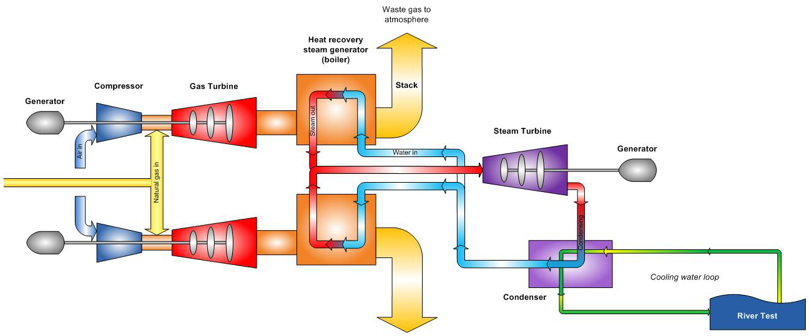

# CCGT

## Introduction

Combined cycle gas turbines are a type of power plant designed to
maximise the power generation from a given fuel, usually natural gas, by
combining two cycles. The first cycle is a conventional Brayton cycle
(gas turbine), in which natural gas is burnt in the presence of
compressed air, generating hot gases. Those are expanded to
near-atmospheric pressure, but their temperature at the turbine outlet
can be as high as 600°C. In other words, a significant amount of energy
is wasted to the environment as thermal losses, and the concept of a
combined cycle is to implement a second cycle, normally a steam Rankine
cycle, to convert part of this waste heat of the flue gases into
electricity. The Brayton cycle is termed the topping cycle, while the
Rankine cycle is termed the bottoming cycle.

<figure markdown="span">
  
  <figcaption>Typical CCGT configuration</figcaption>
</figure>

## ES Model Parameters

All the parameters concerning the CCGT are listed in the table below.

```python exec="on"
from bibdatamanagement import *

print(MdDisplay.print_md_params(bib_file_path='docs/assets/ES_Canada_3.bib',filter_entry='CCGT'))
```

## References

```python exec="on"
from bibdatamanagement import *

print(MdDisplay.print_md_sources(bib_file_path='docs/assets/ES_Canada_3.bib',filter_entry='CCGT'))
```
