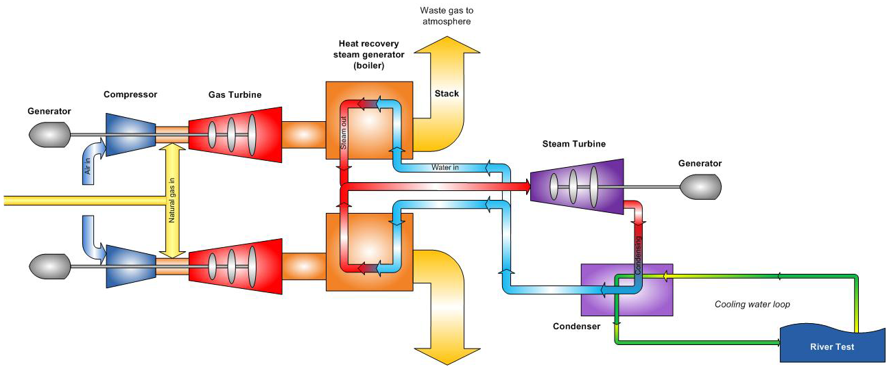

# CCGT with Carbon Capture and storage

## Introduction

Combined cycle gas turbines are a type of power plant designed to
maximise the power generation from a given fuel, usually natural gas, by
combining two cycles. The first cycle is a conventional Brayton cycle
(gas turbine), in which natural gas is burnt in the presence of
compressed air, generating hot gases. Those are expanded to
near-atmospheric pressure, but their temperature at the turbine outlet
can be as high as 600°C. In other words, a significant amount of energy
is wasted to the environment as thermal losses, and the concept of a
combined cycle is to implement a second cycle, normally a steam Rankine
cycle, to convert part of this waste heat of the flue gases into
electricity.


<figure markdown="span">
  
  <figcaption>Typical CCGT configuration</figcaption>
</figure>

CCGT with Carbon Capture and Storage (CCS) includes the
process of capturing carbon dioxide (CO~2~), transporting it to a storage
site, and storing it, with the aim of avoiding an eventual release in
the atmosphere. It is a potential means of mitigating CO~2~ emissions from
human activities, to prevent global warming and ocean acidification

## ES Model Parameters

All the parameters concerning the CCGT CC are listed in the table
below.

```python exec="on"
from bibdatamanagement import *

print(MdDisplay.print_md_params(bib_file_path='docs/assets/ES_Canada_3.bib',filter_entry='CCGT_CC'))
```

## References

```python exec="on"
from bibdatamanagement import *

print(MdDisplay.print_md_sources(bib_file_path='docs/assets/ES_Canada_3.bib',filter_entry='CCGT_CC'))
```
