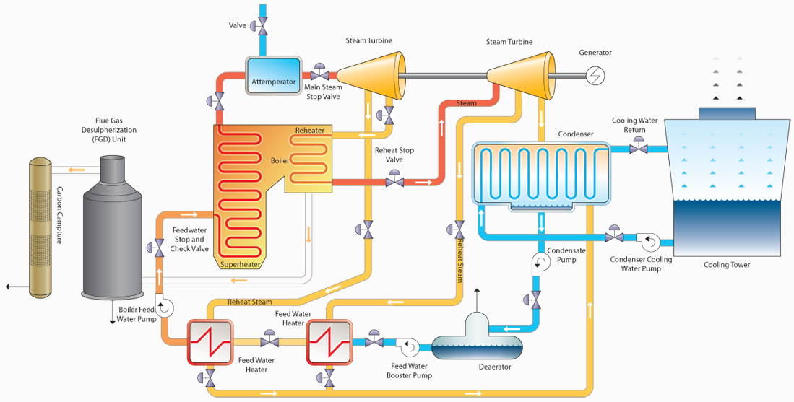

# Coal US

## Introduction

Coal is a combustible rock containing mostly carbon (C) with variable
amounts of other elements such as oxygen (O), hydrogen (H), nitrogen
(N), sulphur (S) and ashes. Coal power plants are thermal power stations
which burn coal to generate electricity. Coal is first pulverised and
then burned in a furnace with a boiler, generating thermal energy (step
1). The produced heat is transferred to a working fluid, usually water
that turns into steam and is superheated (step 2). The produced steam
runs through a power cycle, driving a steam turbine in which mechanical
power is generated (step 3). The typical value of coal power plant
efficiency is about 0.4.

<figure markdown="span">

  <figcaption>Typical coal US configuration</figcaption>
</figure>

## ES Model Parameters

All the parameters concerning the Coal US are listed in the table below.

```python exec="on"
from bibdatamanagement import *

print(MdDisplay.print_md_params(bib_file_path='docs/assets/ES_Canada_3.bib',filter_entry='COAL_US'))
```

## References

```python exec="on"
from bibdatamanagement import *

print(MdDisplay.print_md_sources(bib_file_path='docs/assets/ES_Canada_3.bib',filter_entry='COAL_US'))
```
