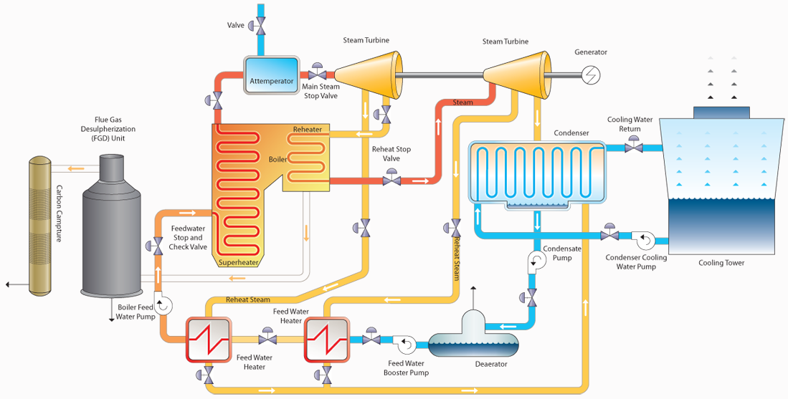

# Coal US Carbon Capture

## Introduction

Coal power plants are thermal power stations which burn coal to generate
electricity. Coal is first pulverised and then burned in a furnace with
a boiler, generating thermal energy (step 1). The produced heat is
transferred to a working fluid, usually water that turns into steam and
is superheated (step 2). The produced steam runs through a power cycle,
driving a steam turbine in which mechanical power is generated (step 3).
The typical value of coal power plant efficiency is about 0.4.

<figure markdown="span">

  <figcaption>Typical coal US configuration</figcaption>
</figure>

The implementation of CCS to a standard power plant could result in a
reduction of the CO~2~ emissions by about 80-90%, at the expense of a
lower plant efficiency (energy penalty of the separation process) and
increased costs (investment and operating ones). These costs may further
increase if the capture site is far from a sequestration one.

## ES Model Parameters

All the parameters concerning the Coal US CC are listed in the table
below.

```python exec="on"
from bibdatamanagement import *

print(MdDisplay.print_md_params(bib_file_path='docs/assets/ES_Canada_3.bib',filter_entry='COAL_US_CC'))
```

## References

```python exec="on"
from bibdatamanagement import *

print(MdDisplay.print_md_sources(bib_file_path='docs/assets/ES_Canada_3.bib',filter_entry='COAL_US_CC'))
```
