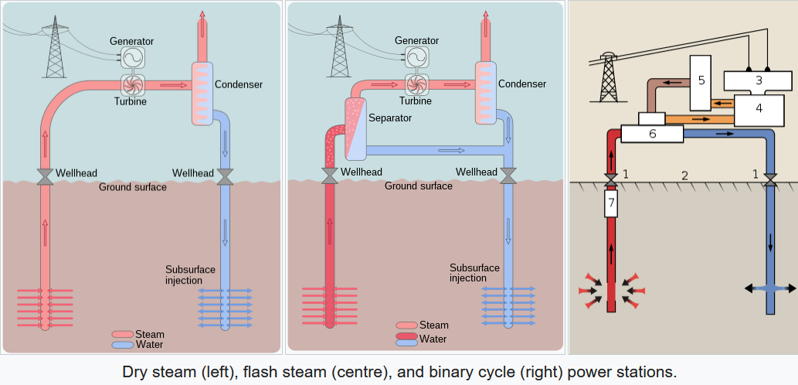

# Geothermal

## Introduction

The use of Geothermalermal water for electricity production in a power
plant requires a higher temperature level, of normally 150°C
to 300°C, which corresponds to a depth of 3 km to 10 km.
These hot source temperatures are nevertheless too low to produce
high-pressure steam, and the use of alternative working fluids, such as organic ones and ammonia, is favoured.

There are four main types of Geothermalermal power plants, based on different energy conversion cycles:

- Dry-steam power plants (oldest/simplest configuration, 27% of
  worldwide installed capacity)
- Flash steam power plants (single (43% of installed capacity)/double (17% of installed capacity))
- Binary cycles (ORC/Kalina, 40% of installed units, but only 6.6% of installed
  capacity)
- others: combined and hybrid power plants.

<figure markdown="span">

  <figcaption>Different types of plants</figcaption>
</figure> 

[^1]

## ES Model Parameters

All the parameters concerning the Geothermal are listed in the table
below.

```python exec="on"
from bibdatamanagement import *

print(MdDisplay.print_md_params(bib_file_path='docs/assets/ES_Canada_3.bib',filter_entry='GEOTHERMAL'))
```

## References

```python exec="on"
from bibdatamanagement import *

print(MdDisplay.print_md_sources(bib_file_path='docs/assets/ES_Canada_3.bib',filter_entry='GEOTHERMAL'))
```

[^1]: [image's source](https://en.wikipedia.org/wiki/Geothermal_power)
