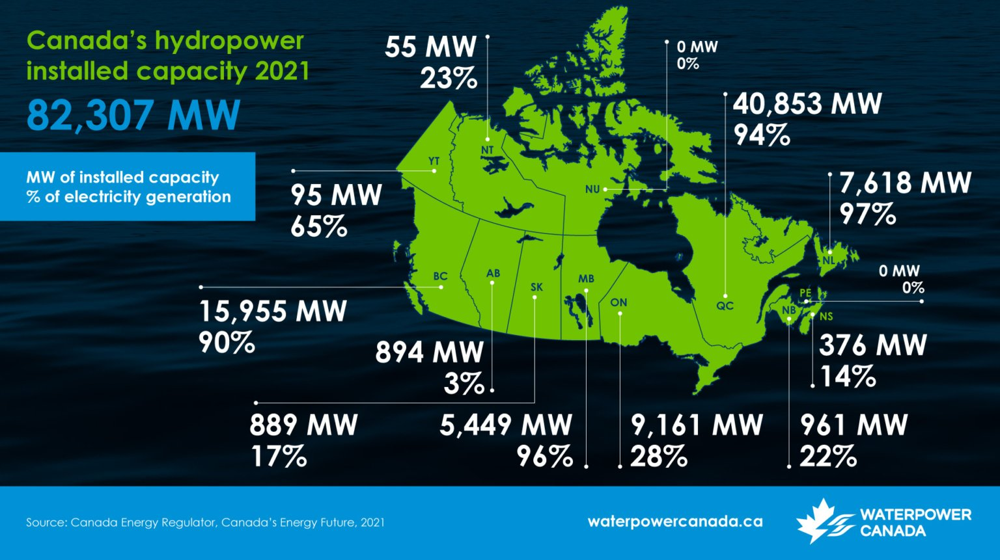

# Hydro Run-of-Hydro River

## 1: Introduction

Hydro power stations can be classified in two main categories: hydro
run-of-Hydro River and hydro dam. The main difference between both is
whether water can be stored and released in periods of high electricity
demand. Hydro run-of-Hydro River is a non dispatchable energy source and
it is operated as baseload for power production.

On-Hydro River hydropower, or run-of-Hydro River hydropower, transforms
the kinetic energy derived from flowing Hydro River water into
electricity, circumventing the need for reservoir creation. Key
technical aspects include:

- **Turbine Technology**: The utilization of hydro turbines—such as
  Kaplan and Francis turbines—enables the conversion of kinetic energy
  to mechanical energy, which is subsequently transformed into
  electrical energy via generators. The selection of turbine type is
  influenced by the hydrological characteristics of the Hydro River.

- **Capacity**: The electrical generation capacity of on-Hydro River
  hydropower systems is contingent upon specific Hydro River
  conditions, notably flow rates and hydraulic head. Capacities can
  range from small-scale installations in the kilowatt (kW) range to
  larger infrastructures with capabilities exceeding multiple
  megawatts (MW).

- **Environmental Impact**: On-Hydro River hydropower is often
  perceived as environmentally favorable relative to reservoir-based
  systems, given the absence of the need for extensive area flooding.
  However, the impact on fish migration and overall Hydro River
  ecology warrants thorough consideration.

- **Efficiency**: The efficiency of hydropower plants in converting
  water kinetic energy to electricity typically spans between 85% and
  90%, influenced by turbine design, type, and the accuracy of turbine
  to Hydro River flow characteristics alignment. However, the capacity
  factor of run of Hydro River projects varies between 40% and 80%. By
  comparison most of large hydroelectric dams with big reservoirs have
  capacity factors closer to 85-90%. The lack of a reservoir also puts
  an upper limit on the size of the run of Hydro River plant so that
  they are only really feasible on Hydro Rivers with large year-round
  flow-rates.

## 2: Global Deployment

On-Hydro River hydropower installations are globally present,
particularly within regions boasting extensive Hydro River networks and
an emphasis on renewable energy resource utilization. In 2021, global
hydropower accounted for an installed capacity of approximately 1,360 GW
[^1], with a significant portion attributable to on-Hydro River systems.

Run-of-Hydro River projects are expected to make up the smallest segment
of the hydropower market over the next ten years, partly because they
tend to be smaller in size than reservoir and PSH plants. Most of the
capacity increases will be in Asia and Latin America, where larger
run-of-Hydro River projects dominate expansion in 2021-2025.

```plotly
{
    "data": [
        {
            "x": ["Rest of world", "China", "Brazil", "United States", "Canada",
                  "Russia", "India", "Japan", "Norway", "Turkey", "France",
                  "Italy", "Spain", "Vietnam", "Switzerland", "Sweden",
                  "Venezuela", "Austria", "Mexico", "Iran", "Colombia"],
            "y": [268.1, 391, 109.4, 101.9, 82.3, 55.7, 51.4, 49.6, 33.4, 31.5,
                  25.5, 22.6, 20.4, 17.3, 16.8, 16.5, 15.4, 14.7, 12.6, 12.2, 11.9],
            "type": "bar"
        }
    ]
}
```

## 3: Use in Quebec and Canada

### Quebec

In Quebec, hydropower, particularly through large-scale reservoir-based
projects, stands as a fundamental pillar in its energy portfolio,
exploiting the province’s abundant hydrological resources. Despite this,
on-Hydro River hydropower also presents discernible potential and has
witnessed some development. According to HydroQuebec in 2023, 37% of
their total installed capacity is run-of-Hydro River installations. This
represents around 13’660 (MW) [^3]

### Canada

Canada’s hydropower infrastructure ranks fourth globally in terms of
size, following China, Brazil, and the United States, and held the third
position in annual hydroelectric production in 2021, generating over 383
TWh. The inception of hydroelectricity in Canada dates back to 1881.
Subsequently, a minimum of 566 hydroelectric plants have been
constructed, cumulatively offering an installed power totaling 82,990 MW
as of 2023. The most expedited growth in capacity was observed from the
1950s through the 1990s, following which a deceleration was noted
towards the late 2000s.

<figure markdown="span">

  <figcaption>Installed Capacity of Hydropower in Canada</figcaption>
</figure>


Over the past five years, hydroelectric production has witnessed an
augmentation of approximately 2,400 MW, with the majority of this power
stemming from the development of large plants such as Romaine-3 (395 MW)
and Romaine-4 (245 MW) in Quebec in 2017 and 2023, respectively, Keeyask
(695 MW) in Manitoba in 2022, and Muskrat Falls (824 MW) in Newfoundland
and Labrador in 2021. While Canada has significantly capitalized on
reservoir-based hydroelectric plants, the utilization and development of
on-Hydro River hydropower, with its minimized environmental footprints
and socio-cultural impacts, remain an avenue for exploration and
potential expansion. [^4]

## ES Model Parameters

All the parameters concerning the Hydro River are listed in the table
below.

### HYDRO_RIVER

```python exec="on"
from bibdatamanagement import *

print(MdDisplay.print_md_params(bib_file_path='docs/assets/ES_Canada_3.bib',filter_entry='HYDRO_RIVER'))
```

## References

```python exec="on"
from bibdatamanagement import *

print(MdDisplay.print_md_sources(bib_file_path='docs/assets/ES_Canada_3.bib',filter_entry='HYDRO_RIVER'))
```

[^1]:  [2022 Hydropower Status Report](https://www.hydropower.org/resources/publications) - International Hydropower
Association, 2022
[^2]:  [Run of River Power - Energy BC.](http://www.energybc.ca/runofriver.html), 2017
[^3]:  [Generating stations - Hydro-Québec Production](https://www.hydroquebec.com/generation/generating-stations.html)-
Hydro-Québec, 2023
[^4]:  [Évaluation du potentiel technique et économique du stockage hydroélectrique par pompage au Canada](https://waterpowercanada.ca/fr/ressources/stockagehydroelectriqueparpompageaucanada) -
Waterpower Canada, 2023
