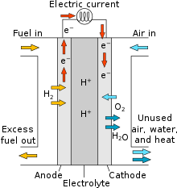

# PAFC

## Overview

Phosphoric Acid Fuel Cells (PAFCs) are a type of fuel cell that uses liquid phosphoric acid as an electrolyte to convert
the chemical energy of fuels, such as hydrogen, into electricity. PAFCs operate at intermediate temperatures (150-200°C)
and are known for their durability and ability to tolerate fuel impurities.

<figure markdown="span">
  
  <figcaption>Diagram of a PA fuel cell</figcaption>
</figure>

## Process Description

1. **Hydrogen Supply**: Hydrogen gas (H~2~) is supplied to the anode side of the fuel cell.
2. **Electrochemical Reaction**: The PAFC operates at intermediate temperatures. The phosphoric acid electrolyte allows
   hydrogen ions (H^+^) to migrate from the anode to the cathode while blocking electrons.
    - **At the Anode**: Hydrogen molecules are split into protons and electrons.
        - H~2~ → 2H^+^ + 2e^-^
    - **At the Cathode**: Protons migrate through the electrolyte and react with oxygen (O~2~) and electrons to form
      water.
        - O~2~ + 4H^+^ + 4e^-^ → 2H~2~O
3. **Electricity Generation**: The movement of electrons through an external circuit generates electricity.
4. **Water Production**: Water is produced as a byproduct at the cathode.

## Benefits

- **Durability**: PAFCs have a longer lifespan compared to other types of fuel cells, making them suitable for
  stationary applications.
- **Fuel Flexibility**: Can tolerate impurities in hydrogen, allowing the use of reformed hydrocarbons as fuel.
- **Stable Operation**: Intermediate operating temperatures provide a balance between efficiency and material
  durability.

## Applications

- **Stationary Power Generation**: Used in commercial, industrial, and residential power generation systems.
- **Combined Heat and Power (CHP)**: Provides both electricity and useful heat for various applications, enhancing
  overall energy efficiency.
- **Backup Power**: Ideal for providing reliable backup power for critical infrastructure.

## Challenges

- **Cost**: High initial costs for PAFC systems and materials.
- **Efficiency**: Lower efficiency compared to some other types of fuel cells, such as SOFCs.
- **Phosphoric Acid Management**: Handling and containment of phosphoric acid require careful management to avoid
  corrosion and other issues.

## Future Outlook

Advancements in materials and system designs are expected to improve the performance and reduce the costs of PAFCs. With
their proven durability and ability to use less pure hydrogen, PAFCs are well-suited for a range of stationary power
applications, contributing to a more resilient and efficient energy infrastructure.

## ES Model Parameters

All the parameters concerning the PAFC are listed in the table
below.

```python exec="on"
from bibdatamanagement import *

print(MdDisplay.print_md_params(bib_file_path='docs/assets/ES_Canada_3.bib',filter_entry='PAFC'))
```

## References

```python exec="on"
from bibdatamanagement import *

print(MdDisplay.print_md_sources(bib_file_path='docs/assets/ES_Canada_3.bib',filter_entry='PAFC'))
```
