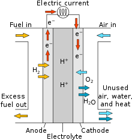

# Proton Exchange Membrane Fuel Cell (PEMFC)

## Overview

A Proton Exchange Membrane Fuel Cell (PEMFC) is an electrochemical device that converts the chemical energy of hydrogen
and oxygen into electricity and water. PEMFCs operate at relatively low temperatures and are known for their high power
density, quick start-up, and suitability for a variety of applications, especially in transportation and portable power.

<figure markdown="span">
  
  <figcaption>Diagram of a PEM fuel cell</figcaption>
</figure>

## Process Description

1. **Hydrogen Supply**: Hydrogen gas (H~2~) is supplied to the anode side of the fuel cell.
2. **Electrochemical Reaction**: The PEMFC operates at low temperatures (typically 60-80°C). The proton exchange
   membrane allows only protons (H~+~) to pass through while blocking electrons.
    - **At the Anode**: Hydrogen molecules are split into protons and electrons.
        - H~2~ → 2H^+^ + 2e^-^
    - **At the Cathode**: Protons migrate through the membrane and react with oxygen (O~2~) and electrons to form water.
        - O~2~ + 4H^+^ + 4e^-^ → 2H~2~O
3. **Electricity Generation**: The movement of electrons through an external circuit generates electricity.
4. **Water Production**: Water is produced as a byproduct at the cathode.

## Benefits

- **High Efficiency**: Converts hydrogen to electricity with efficiencies up to 60%.
- **Clean Energy**: Produces only water as a byproduct, making it an environmentally friendly technology.
- **Quick Start-Up**: Suitable for applications requiring rapid power delivery.
- **High Power Density**: Provides high power output relative to its size and weight.

## Applications

- **Transportation**: Used in fuel cell vehicles (FCVs) including cars, buses, and trucks.
- **Portable Power**: Ideal for portable power units, backup power systems, and small-scale power generation.
- **Stationary Power**: Employed in stationary power generation for residential, commercial, and industrial uses.

## Challenges

- **Cost**: High costs associated with fuel cell materials, especially platinum catalysts.
- **Hydrogen Infrastructure**: Requires a robust hydrogen production, storage, and distribution network.
- **Durability**: Membrane degradation and catalyst poisoning can affect long-term performance and durability.

## Future Outlook

Advancements in catalyst development, membrane materials, and system integration are expected to drive down costs and
improve the performance and durability of PEMFCs. With increasing focus on hydrogen infrastructure and clean energy
policies, PEMFCs are positioned to become a key technology in the transition to sustainable and low-carbon energy
systems.

## ES Model Parameters

All the parameters concerning the PEM FC are listed in the table
below.

```python exec="on"
from bibdatamanagement import *

print(MdDisplay.print_md_params(bib_file_path='docs/assets/ES_Canada_3.bib',filter_entry='PEMFC'))
```

## References

```python exec="on"
from bibdatamanagement import *

print(MdDisplay.print_md_sources(bib_file_path='docs/assets/ES_Canada_3.bib',filter_entry='PEMFC'))
```
