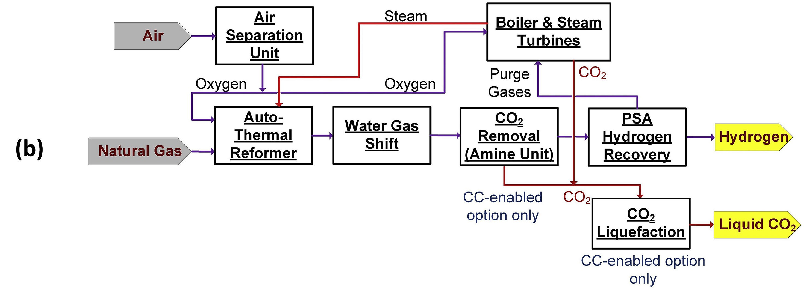

# Auto-Thermal Reforming CC

## Introduction

In the current landscape of technological
advancements, Autothermal Reforming (ATR) represents a viable method for
the reforming of methane. This process employs both oxygen and steam to
achieve partial oxidation of methane within reforming tubes [^2].
Notably, the ATR system operates at a higher temperature compared to
Steam Methane Reforming (SMR) [^3], thereby enhancing the conversion
efficiency of methane.

The principal distinction between Autothermal Reforming (ATR) and Steam
Methane Reforming (SMR) technologies lies in the employment of
high-purity oxygen in ATR, as illustrated in Figure 1b. In the ATR
process, a mixture of natural gas, steam, and oxygen is introduced. This
blend not only undergoes reforming reactions but also facilitates
partial combustion of natural gas within the reforming tubes to supply
the necessary energy for the reforming process. Although the production
cost of hydrogen via ATR is elevated compared to SMR, primarily due to
the expenses associated with oxygen production, ATR offers significant
advantages. Notably, the syngas and flue gas streams, emanating from the
boiler unit, are not diluted with nitrogen. Consequently, CO~2~ removal
and liquefaction processes are simplified in ATR compared to SMR, as
detailed in the Methods section. This attribute renders ATR more
advantageous for carbon capture applications.[^1]

<figure markdown="span">
  
  <figcaption>Simplified block diagrams of hydrogen production technologies: (b) ATR natural gas reforming</figcaption>
</figure>

In the configuration of ATR coupled with a carbon capture system, the
hydrogen-rich syngas produced is subsequently directed to the CO~2~
removal unit. Within this unit, diglycolamine (DGA) serves as the
solvent for the extraction of CO~2~ from the syngas

## ES Model Parameters

All the parameters concerning the Auto-Thermal Reforming CC are listed
in the table below.

```python exec="on"
from bibdatamanagement import *

print(MdDisplay.print_md_params(bib_file_path='docs/assets/ES_Canada_3.bib',filter_entry='ATR_CCS'))
```

## References

```python exec="on"
from bibdatamanagement import *

print(MdDisplay.print_md_sources(bib_file_path='docs/assets/ES_Canada_3.bib',filter_entry='ATR_CCS'))
```

[^1]: Khojasteh Salkuyeh, Yaser, et al. “Techno-economic analysis and
life cycle assessment of hydrogen production from natural gas using
current and emerging technologies.” Int. J. Hydrogen Energy, vol. 42,
no. 30, 27 July 2017, pp. 18894-909,
[doi:10.1016/j.ijhydene.2017.05.219.](https://doi.org/10.1016/j.ijhydene.2017.05.219.)

[^2]: Aasberg-Petersen, Kim, et al. “Recent developments in autothermal
reforming and pre-reforming for synthesis gas production in GTL
applications.” Fuel Process. Technol., vol. 83, no. 1, 15 Sept. 2003,
pp. 253-61, <doi:10.1016/S0378-3820(03)00073-0>.

[^3]: Holladay, J. D., et al. “An overview of hydrogen production
technologies.” Catal. Today, vol. 139, no. 4, 30 Jan. 2009, pp. 244-60,
<doi:10.1016/j.cattod.2008.08.039>.
