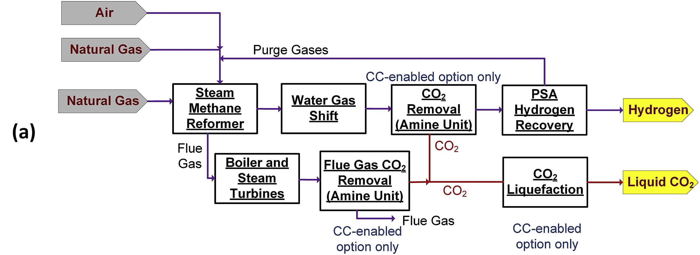

# Steam Methane Reforming

## Introduction

In the Steam Methane Reforming (SMR) process,
depicted in Figure 1a, natural gas is combined with high-pressure steam
and introduced into reforming tubes containing catalysts conducive to
the reforming reactions. These reactions are inherently endothermic,
necessitating the integration of a furnace within the reforming section
to provide the essential thermal energy. The fuel for this furnace is
sourced from natural gas and the purge stream from the Pressure Swing
Adsorption (PSA) unit.[^1]

<figure markdown="span">
  
  <figcaption>Simplified block diagrams of hydrogen production technologies: (a) SMR natural gas reforming source:(1)</figcaption>
</figure>

## ES Model Parameters

All the parameters concerning the Steam Methane Reforming are listed in
the table below.

```python exec="on"
from bibdatamanagement import *

print(MdDisplay.print_md_params(bib_file_path='docs/assets/ES_Canada_3.bib',filter_entry='SMR'))
```

## References

```python exec="on"
from bibdatamanagement import *

print(MdDisplay.print_md_sources(bib_file_path='docs/assets/ES_Canada_3.bib',filter_entry='SMR'))
```

[^1] Khojasteh Salkuyeh, Yaser, et al. “Techno-economic analysis and
life cycle assessment of hydrogen production from natural gas using
current and emerging technologies.” Int. J. Hydrogen Energy, vol. 42,
no. 30, 27 July 2017, pp. 18894-909,
www.sciencedirect.com/science/article/pii/S0360319917322036.
