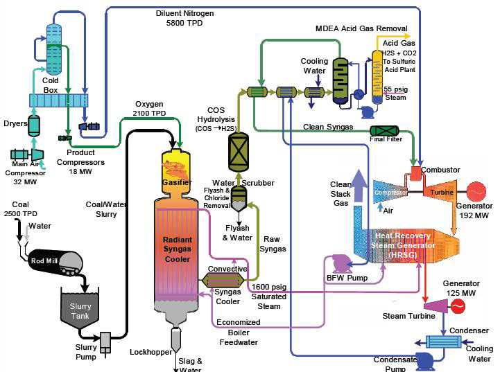

# Coal IGCC CC

## Introduction

The Integrated Gasification is a technology used for gasifying coal
(generating a high-value gas stream out of a solid). Both coal and
biomass can be processed in these systems, and reduced amounts of
air/oxygen are required as CO~2~ is an undesirable product. At the
difference of coal combustion, coal is not necessarily pulverised. It is
fed to a gasifier in oxygen-lean conditions, which results in the
generation of a mixture of CO, H~2~, CO~2~, H~2~O, and pollutants such as
sulphur and nitrogen oxides. This syngas is cleaned (removal of sulphur
and nitrogen oxides through, for example, Claus treatment), cooled down
and then burnt in a conventional gas turbine (GT), or fed into a solid
oxide fuel cell (SOFC). IGCC power plants are next-generation power
plants but are far more scarse as their design is more complex and
capital costs significantly higher. IGCC plants with carbon capture
nearly double their capital investment cost.


<figure markdown="span">

  <figcaption>Typical IGCC configuration</figcaption>
</figure>

## ES Model Parameters

All the parameters concerning the Coal IGCC Capt are listed in the table
below.

```python exec="on"
from bibdatamanagement import *

print(MdDisplay.print_md_params(bib_file_path='docs/assets/ES_Canada_3.bib',filter_entry='COAL_IGCC_CC'))
```

## References

```python exec="on"
from bibdatamanagement import *

print(MdDisplay.print_md_sources(bib_file_path='docs/assets/ES_Canada_3.bib',filter_entry='COAL_IGCC_CC'))
```
